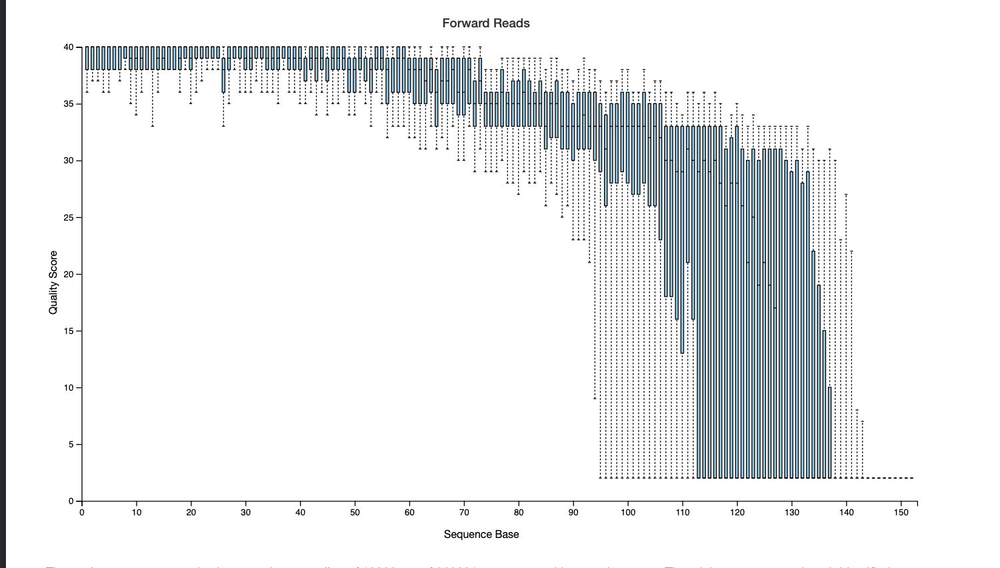

```{r, include = FALSE}
ottrpal::set_knitr_image_path()
```

# Microbiome Sequencing

<div class = "notice">
Some content in this document is derived from other QIIME 2 documentation resources, where it is licensed under CC BY-NC-ND 4.0. It is used here with special permission for a derived work from Greg Caporaso, on behalf of its authors.
</div>

## Learning Objectives

```{r, fig.alt = "Learning Objectives", out.width = "100%", echo = FALSE}
ottrpal::include_slide("https://docs.google.com/presentation/d/1YwxXy2rnUgbx_7B7ENH9wpDX-j6JpJz6lGVzOkjo0qY/edit#slide=id.g2668d07d0b9_0_0")
```

## A Brief Introduction to Microbiomes


Microbes are everywhere. We have found these tiny organisms in the deepest regions of the ocean and in the upper atmosphere. We have found them in:
+ water that has been solid ice for millennia in the Antarctic
+ boiling water in the geysers of Yellowstone National Park.
+ the driest natural environments on Earth, including the Atacama Desert in Chile, where desiccation resistant microbes hide in the soil sometimes waiting ten years for the drop of rain that will jump start their metabolism long enough for them to reproduce before they return to dormancy.
+ perpetually damp environments, like the intestinal tract of the human body where they are constantly the subject of inspection by our diligent immune cells, and where they impact our health in positive and negative ways that we are only beginning to understand.
+ our nuclear reactors, prompting questions about whether we could harness them as tiny machines to help us remediate environmental disasters of the past, present, and future.

 If we looked hard enough, I think we’d find them on the surface of the moon and Mars, though they are probably microbes who stowed away on our spacecraft and are now patiently waiting for a drop of water that may or may not ever show up. If we ever colonize those worlds, microbes will be an indispensable ally in creating an environment that could sustain us.

```{r, fig.alt = "Learning Objectives", out.width = "100%", echo = FALSE}
ottrpal::include_slide("https://docs.google.com/presentation/d/1YwxXy2rnUgbx_7B7ENH9wpDX-j6JpJz6lGVzOkjo0qY/edit#slide=id.g26ebab787e9_0_0")
```
This figure is adapted from [@Tignat-Perrier2022] under Creative Commons license.

Microbes almost never live alone in the real world (i.e., outside of a laboratory). Rather they exist in communities of different species who are interacting with each other and their environment. Some of these communities will have many different types of organisms, and some will have only a few. Because of the large number of species and individuals involved, no two communities will ever be exactly alike, and quantifying differences between microbial communities is an important area of research at the moment. The types of interactions between organisms are also highly varied. These can include mutualistic relationships, where both organisms benefit from the interaction; parasitic relationships, where one organism exclusively benefits to the detriment of the other; and the full gradient in between.

Microbiome science is everywhere. There are tens of articles published daily in the scientific literature, and many popular science articles and books present these findings to the world of non-scientists. Understanding the promises and limitations of the methods of microbiome science can help avoid misconceptions about microbiome research, and it’s important for practitioners of microbiome science to understand and convey the promise and limitations of our field. Misconceptions abound, frequently arising from the same sources as high-quality popular science microbiome reporting.


For example, on 5 Feb 2015 an article appeared in the New York Times noting (almost offhand) that Yersinia pestis, the organism responsible for Bubonic plague, had been found in multiple locations throughout the New York City subway system as part of its normal built environment microbiome. This was rapidly followed up on 6 Feb 2015 with an article noting that there was probably not Bubonic plague on the subway system after all, but rather that the approaches used by the research team are limited in their taxonomic resolution, and that likely a harmless close relative of Y. pestis was observed:

>“What the researchers probably found, [a spokesman for the university where the study originated] said, was bacteria from an unknown species or from organisms that happened to share some gene sequences with the plague bacterium…”.


As microbiome services and products are increasingly marketed directly to the public, consumers of microbiome research findings, products, and services need to know how to critically evaluate these offerings and their associated claims. As practitioners in the field, we can help by ensuring that the methods we apply are appropriate and reliable, and that we make our work accessible.

## Goals of Amplicon analysis

The technologies that are enabling work in microbiome science are the same that are driving the data revolution in biology. Primarily this work is driven by high-throughput DNA sequencing, which is applied for profiling microbial community composition:

+ marker gene profiling (such as 16S or ITS sequencing)
+ functional potential (such as shotgun metagenomic sequencing)
+ functional activity (such as metatranscriptome sequencing)

Other “omics” technologies are now playing an increasing role in microbiome research, such as:

+ mass-spectrometry-based metabolomics, which provides profiles of small molecule metabolites in an environment.
+ metaproteomics which provides more detailed descriptions of functional activities of microbes (and their hosts, if applicable).

 As a result, bioinformatics software tools are essential to microbiome research. For many microbiome researchers, bioinformatics is an intimidating and challenging aspect of their projects.


## Microbiome Analysis with QIIME 2
QIIME 2 is an all in one bioinformatics microbiome analysis platform. This platform allows for users to go from sequenced microbiome data to publication ready visualizations. The original QIIME, now referred to as QIIME 1, was published in 2010 [@Caporaso2010] and has been cited tens of thousands of times in the primary literature. QIIME 2, which was published in July of 2019 [@Bolyen2019], succeeded QIIME 1 on 1 January 2018. QIIME 2 is better than QIIME 1 in all ways, and QIIME 1 is no longer actively supported. If you have previously used QIIME 1, you should invest time in learning and switching to QIIME 2. If you’re new to QIIME, start with QIIME 2. (When I refer to QIIME in this book, without specifying whether I’m referring to QIIME 1 or QIIME 2, I’m referring to the platform generally.)

QIIME 2 has large and growing user and developer communities, and these communities make QIIME 2 possible. The epicenter of the community is the QIIME 2 Forum. The forum is primarily known as a place where users can get technical support with QIIME 2 for no charge. Developers of QIIME 2 moderate the forum, and typically respond to technical support questions within a couple of business days. The forum is also a great place to discuss general topics in microbiome bioinformatics, or microbiome research methods generally. There are many active discussions on these topics on the forum. Keeping up with the discussions on the forum is a great way to learn about current topics in microbiome research methods. There’s also a free job board on the forum - you can use the forum to find jobs, or post your own job ads there to find employees who are well-versed in QIIME 2 and other bioinformatics tools. If you’re not already a member of the QIIME 2 Forum, you should consider joining. It’s a great way for you to get help, and as you develop your QIIME 2 skills helping others on the forum is a great way to reenforce your learning and to get involved in the community.

[Here](https://gregcaporaso.github.io/q2book/front-matter/preface.html) is a high-level introduction to microbiome analysis using QIIME 2. This introduction will go over common methods, metrics and approaches used for microbiome science.
So grab a cup of your favorite hot beverage and let’s get started! ☕

## Microbiome Amplicon Analysis

QIIME 2 is a widely used platform for analysis of [amplicon data](https://hutchdatascience.org/Choosing_Genomics_Tools/microbiome-sequencing.html#goals-of-amplicon-analysis), also referred to as marker gene data, generated to study microbiomes. The primary source of QIIME 2 documentation for amplicon data analysis is *Microbiome marker gene analysis with QIIME 2*, which can be found at [https://amplicon-docs.qiime2.org/](https://amplicon-docs.qiime2.org/). This document describes the general workflow, and unless otherwise noted all steps described here are ones that can be performed in QIIME 2. To learn the corresponding commands to carry out this workflow in QIIME 2, we refer you to the “gut-to-soil” tutorial, available in *Microbiome marker gene analysis with QIIME 2*. If you are interested in performing microbiome analysis from “shotgun” metagenomics data, we refer you to MOSHPIT and its documentation: [https://moshpit.qiime2.org/](https://moshpit.qiime2.org/). MOSHPIT and QIIME 2 are related tools, and data can easily be passed back and forth between the two, as both are built on [the rachis framework](https://rachis.org) for reproducible biological data science tools.

### Metadata

Metadata, like in most sciences, is vital to analyzing your microbiome data. Without metadata there is limited information to gain about the sequenced microbiome. MIxS Standards are a common metadata standardization practice used by data repositories, like SRA, that ensure minimal viable information for your sequences. Check out [MIxS standards](https://genomicsstandardsconsortium.github.io/mixs/) for more information! For more information on using MIxS standards in QIIME 2, check out this [youtube video](https://www.youtube.com/watch?v=erklD1bofzE)!

**Be on the lookout!** Throughout this course we will pause and discuss necessary metadata information for specific steps.

### Upstream analysis: “Preparing the data”

#### Importing data for use in QIIME 2

Initially loading your data in an analysis tool, like QIIME 2, can sometimes be the most difficult part of an analysis. It's important to know what **format** your data, and that format will need to be compatible with the tool that you’re using. This may sometimes involve converting your data from the format it is currently in to one that is compatible with the tool that you’re trying to use.

This [how-to guide](https://amplicon-docs.qiime2.org/en/latest/how-to-guides/how-to-import.html) can walk you through the most common data formats used for importing into QIIME 2. If you’re stuck at this step, search the QIIME 2 Forum for help. If you don’t find an answer to your question, feel free to post your question to the forum - the team is very used to helping people import their data, and they will be more than happy to help you

#### Demultiplexing

Sometimes, but not always, the data you receive from the sequencer will be pooled into one fastq file. At this stage, the sequences are all grouped together and not grouped by sample. We will need to use the barcode (a short synthetic unique sequence) that was attached to all your sequences during sample prep to identify what sequence belongs to each sample. For example, `sample-1` might be assigned the barcode `TGACCGTACGTA`, and `sample-2` might be assigned the barcode `TGGTAGACCCGT`. All sequences derived from `sample-1` will have the `sample-1` barcode associated with them, and all sequences derived from `sample-2` will have the `sample-2` barcode associated with them. Assigning sequences to the sample they are derived from is referred to as *demultiplexing* the sequencing run.

**Metadata requirement:** If you have multiplexed sequences (where sequences from all samples are pooled) you will need barcode information for each sample so that you can track what sample each sequence comes from.

For more information about demultiplexing with QIIME 2, Visit Our [Docs on Demultiplexing](https://amplicon-docs.qiime2.org/en/latest/references/plugins/demux.html#q2-plugin-demux)!

Alternatively, your data may already be demultiplexed, meaning that you have one or more fastq files for each sample in your study. If that's the case you can skip the demultiplexing step.

#### Preparing the sequences

##### Removal of Primers and Barcodes

There are a few synthetic sequences that are used in sample preparation that can be in your data and that you will want to remove. The most common sequences are the PCR primers for your target amplicon, adapters for the sequencing machine and barcodes for sample identification.

[The sequencing chapter](https://hutchdatascience.org/Choosing_Genomics_Tools/sequencing-data.html) earlier in this course has more information about how these primers and adapters are added to the data and used!

Sometimes these synthetic sequences will not be contained in your data, or they will have already been removed for you. For example the Earth Microbiome Project protocol does not sequence PCR primers, so if you have EMP protocol sequences you will not need to worry about primers in your sequences. More information about the EMP protocol can be found [here](https://earthmicrobiome.org/protocols-and-standards/16s/).

##### Sequence Quality Scores, Filtering and Trimming

After sequence data has been demultiplexed and any synthetic attachments have been removed, we are ready to move on to sequence quality control! Next we will discuss **sequencing noise**, and **sequence quality** as well as methods for trimming sequences.

Sequencers are not perfect and sometimes have the wrong base call. In order to understand how certain we are that the nucleotide sequenced is the correct nucleotide we associate quality scores with the sequences. More information about fastq files and **sequence quality** can be found in the [sequencing data chapter](https://hutchdatascience.org/Choosing_Genomics_Tools/sequencing-data.html) of this course.

Quality scores for Illumina sequencing data are calculated as Q = -10 × log~10~(e) where e is the estimated probability of the base call being wrong. If the calculated Q equals 20, that means the likelihood of an error is 1 in 100. More information on quality score calculations can be found in the [Illumina documentation](https://www.illumina.com/science/technology/next-generation-sequencing/plan-experiments/quality-scores.html).

```{r, fig.alt = "Example of quality score boxplot, as generated by QIIME 2.", out.width = "100%", echo = FALSE}

```

Sequencing noise is error arising during the sequencing stage of data generation (as opposed to during PCR, for example). This is typically apparent when plotting average quality by sequencing position, as in this example. In this quality box plot, we can see that after about 110 nucleotides, the average quality scores are dropping quickly and the variation in quality scores at each position is increasing.. This is probably a sign of sequencing noise becoming more problematic around position 100.

Quality filtering tools commonly discard whole sequences if the quality is too low, so trimming positions at the beginning or end of sequences where the average quality is low is fairly common in microbiome data analysis. A common heuristic is to truncate sequences after the median quality score drops below 30 or 20. We will dive in more about fine-tuning where to trim sequences based on sequencing length and merging of paired end reads in the next section.

Commonly used software for quality filtering and trimming are:

* DADA2: https://benjjneb.github.io/dada2/
* Fastp: https://academic.oup.com/bioinformatics/article/34/17/i884/5093234
* Deblur: https://github.com/biocore/deblur/

**Note**: these tools provide more functionality than just quality filtering and trimming, so many of them will be commonly used for multiple processing steps.

##### Merging: Target Amplicon Length and Sequencing Length

This section discusses paired-end sequencing read data. If you want to learn more about paired-end vs single-end reads, please refer to the [sequencing data chapter](https://hutchdatascience.org/Choosing_Genomics_Tools/sequencing-data.html).

If we have a forward and reverse reads (i.e., paired-end read data), we typically merge these to create one read. In order to merge, we need long enough forward and reverse reads to support about 12bp of overlap. So we need to do some math to figure out how much we can truncate (if we need to truncate) without losing our ability to merge.

In order to make an informed decision about where to trim and how to merge our paired-end data, we need to answer two major questions:

1) How long is your target amplicon?

2) What sequencing length did you sequence at?

It's important to know that 16S rRNA primers are numbered based on the *E.coli* 16S sequence, and there are insertions and deletions in the 16S rRNA, so primer positions (e.g., 515F, 806R) can only give you an estimate of the length of the target amplicon. This is generally true for other amplicons as well.

For example, imagine we sequenced using 2x250 (i.e., paired end reads of 250 bases) and we are sequencing the v4 region of the 16S rRNA using forward primer 515F and reverse primer 806R. Using the knowledge of our primers, we can calculate that our region length is roughly:

806 (the location of the reverse primer) - 515 (the location of the forward primer) = **291 bases**

Since we need 12 bases of overlap minimum to merge we can added 12 bases to our estimated length to account for that:

291+12 = **303 base**

So on average we should be able to merge if our forward read length plus our reverse read length is greater than or equal to 303 bases.

In this example we sequenced at 2x250, meaning our forward read and reverse read should each be 250 bp long. If we merged these reads together without trimming we would have sequences that are 488bp (250+250-12), which means in terms of merging our reads together,  we have some room to trim our reads and still retain the ability to merge them.

If we sequenced at 2x250 but the quality declined after 200 nucleotides, we could truncate at 200 and still have 388bps (200+200-12), which is more than enough to see successful merging for most of our amplicons.

Remember that all this math is based on *E. coli*, and 16S rRNA variable regions vary in length. It’s possible that this estimate won’t always work out. The best way to calculate this would be to extract reads from a reference database using your primers, and then review the distribution of the resulting sequence lengths. You can do this using [the extract-reads action in QIIME 2](https://amplicon-docs.qiime2.org/en/stable/references/plugins/feature-classifier/#q2-action-feature-classifier-extract-reads).

Commonly used software for merging reads are:

* Dada2: https://benjjneb.github.io/dada2/
* Fastp: [https://academic.oup.com/bioinformatics/article/34/17/i884/5093234](https://academic.oup.com/bioinformatics/article/34/17/i884/5093234)
* Vsearch: [https://github.com/torognes/vsearch](https://github.com/torognes/vsearch)

##### Chimera Removal

What is a Chimera?

A chimera, in sequencing data, is an artificial sequence made from fragments of multiple real sequences but it itself is an artifact of PCR amplification. Since this is not a real biological signal, we will want to remove these.

There are two major approaches to chimera detection and removal. The chimera can be identified with ***de novo*** or **reference** based methods.

Denovo based methods compare all the sequences in your dataset and calculate the probability that read 1 is a mix of read 2 and read 3. An example *de novo* method can be found in the [QIIME 2 Vsearch Docs (see *uchime-denovo)*](https://amplicon-docs.qiime2.org/en/latest/references/plugins/vsearch.html#q2-action-vsearch-uchime-denovo).

Reference based methods take reference chimera sequences and detect potential chimeras based on their alignment to the reference. An example reference method can be found in the [QIIME 2 Vsearch Docs (see *uchime-ref)*](https://amplicon-docs.qiime2.org/en/latest/references/plugins/vsearch.html#q2-action-vsearch-uchime-ref).

*De novo* methods are most common among microbiome analysis workflows.

Commonly used software for removing chimeric reads are:

* Uchime: https://drive5.com/usearch/manual/uchime_algo.html

Many quality control workflows incorporate chimera removal:

* Dada2: [https://benjjneb.github.io/dada2/](https://benjjneb.github.io/dada2/)
* Fastp: https://academic.oup.com/bioinformatics/article/34/17/i884/5093234

##### Defining your microbiome features

What is a feature?

A feature is a purposely vague term meaning any unit of observation in the microbiome like a sequence, Amplicon Sequence Variants (ASV), Observational Taxonomic Unit (OTU), metabolite, transcript, etc.

The two most common units of observation in amplicon microbiome analysis are **ASVs** and **OTUs.**

ASVs are *amplicon sequence variants,* and are defined as all of the unique post-quality-control sequences in the dataset.

On the other hand OTUs, or Operational Taxonomic Units, are ASVs clustered at a similarity threshold. Common similarity thresholds are 97%, 98% and 99%, and in this case features will contain all sequences that are within the similarity threshold to the “centroid” sequence of the OTU (generally chosen based on prevalence).

For example, if I have 2 sequences that are 98% similar and my similarity threshold is 97%, those two sequences would likely be grouped into the same OTU feature, and would be considered two separate ASV features. As of this writing (September 2026), ASV features are far more commonly used than OTU features, as they provide higher resolution. OTUs were common in older microbiome studies, when quality control methods were less well developed, and this process therefore served as a crude approach to quality control (i.e., assume that minor variations from common sequences represent sequencing error).

We recommend the use of ASVs, not OTUs, but QIIME 2 does support OTU clustering (see the [QIIME 2 OTUs Clustering How-to Guide](https://amplicon-docs.qiime2.org/en/latest/how-to-guides/cluster-reads-into-otus.html))

ASVs are commonly made by dereplicating the sequences in all your samples post quality control, and this information is summarized in a *feature table* that tabulates the number of occurrences of each ASV on a per sample basis. The feature table is fundamental to microbiome data analysis, and is widely used in all downstream analysis.

Example Feature Table

|  | ASV 1 | ASV 2 | ASV 3 |
| :---- | :---- | :---- | :---- |
| Sample 1 | 10 | 9 | 3 |
| Sample 2 | 0 | 1 | 4 |
| Sample 3 | 11 | 0 | 1 |

Commonly used software for dereplicating sequences and defining feature tables are:

* Dada2: [https://benjjneb.github.io/dada2/](https://benjjneb.github.io/dada2/)
* Deblur: [https://github.com/biocore/deblur/](https://telatin.github.io/microbiome-bioinformatics/Metabarcoding-deblur/)
* Vsearch: [https://amplicon-docs.qiime2.org/en/latest/references/plugins/vsearch.html#q2-action-vsearch-dereplicate-sequences](https://amplicon-docs.qiime2.org/en/latest/references/plugins/vsearch.html#q2-action-vsearch-dereplicate-sequences)

##### Putting it All Together

All the ‘**preparing the sequences**’ steps that we just described can be carried out by a single workflow, or as independent analysis steps. DADA2 is an example of a workflow that trims, denoises, merges, and dereplicates sequences, producing a ASV-based feature table.

The [Gut to Soil Tutorial](https://amplicon-docs.qiime2.org/en/stable/tutorials/gut-to-soil.html) provides commands and illustrations for these pre-processing steps on real world data, and we recommend that as the primary resource for learning to use QIIME 2. The [QIIME 2 Youtube channel](https://www.youtube.com/watch?v=PmtqSa4Z1TQ&list=PLbVDKwGpb3XmkQmoBy1wh3QfWlWdn_pTT&index=12) also has a detailed video on these trimming, denoising, merging, and deprecating steps.

#### The importance of host genomics read removal

When working with human microbiome data, it's important that we are aware that host genomic reads can accidentally end up in our microbiome data. This is more common with untargeted microbiome approaches like metagenomics. (Amplicon data is considered “targeted” because it targets a specific region of the genome, where metagenomics sequences all DNA in the microbiome).

It is important to make sure there is no personally identifying information in human microbiome studies, especially if you plan on publishing the data. While it might seem impossible,  [researchers were able to recreate host genomes from publicly available microbiome metagenomic data](https://www.nature.com/articles/s41564-023-01381-3). This is problematic as it compromises study participants' privacy, likely violates human subjects research protocols (which can cause projects to be shut down), and can erode confidence and trust in research. It is therefore always a good idea to run a host read identification and removal step on your data, even if it is unlikely to contain significant host reads (as is the case for amplicon data).

Removal is commonly done by [building a bowtie2](https://amplicon-docs.qiime2.org/en/latest/references/plugins/quality-control.html#q2-action-quality-control-bowtie2-build) database with host reference pangenome and [aligning your reads](https://amplicon-docs.qiime2.org/en/latest/references/plugins/quality-control.html#q2-action-quality-control-filter-reads) to that reference database. Sequences that align well to the reference should be removed from your dataset. A second step includes subsequently assigning taxonomy to your ASV sequences, and removing any sequences that are not classified to a Bacterial or Archaeal phylum (assuming that you’re using primers that target one or both of these groups).

[Here is an example](https://moshpit.qiime2.org/en/stable/chapters/01_filtering/host-filtering.html) of this workflow in the MOSHPIT, our recommended tool for metagenome data analysis.

#### Phylogenetic Trees

Some microbiome diversity metrics that we’ll discuss shortly incorporate relatedness of the features. These are referred to as relatedness-based distance metrics. As of this writing, the most common way that relatedness is incorporated in a diversity metric is through a phylogenetic tree built from the ASV sequences (and possibly a reference database and tree). In addition to the feature table, generation of a phylogenetic tree for use in relatedness-based diversity metrics is an optional data preparation step before beginning detailed analysis.

QIIME 2 offers a few ways to build phylogenetic trees for use in computing phylogenetic diversity metrics, including a reference-based approach and de novo approaches. Each of these methods has benefits and drawbacks. The reference-based approach uses a pre-computed reference tree and then inserts the observed sequences into that tree. De novo tree building, an alternative, doesn’t rely on any outside information. Reference-based tree building is generally considered to result in a higher-quality tree than de novo tree building, but you need to have a tree that you trust to begin with. Reference-based tree building is illustrated in QIIME 2’s Parkinson's Mouse tutorial, and de novo tree building is illustrated in QIIME 2’s Moving Pictures tutorial. In QIIME 2’s gut-to-soil tutorial, we opt for the simpler kmer-based approach for computing relatedness-based diversity metrics so we will skip the phylogenetic reconstruction step.

For a detailed lecture on creating phylogenetic trees for microbiome data analysis, [watch this video from our free youtube workshop.](https://www.youtube.com/watch?v=0nEabGxFxlY)

#### Taxonomic Annotation

Now that we have all of our dereplicated sequences, a final optional data preparation step is taxonomic annotation (also referred to as taxonomic classification) of the ASV sequences.

Here, we will briefly discuss taxonomic annotation methods. For more detailed information watch [this lecture by Dr. Ben Kaehler](https://www.youtube.com/watch?v=Z9w2VZHJMZs).

There are two major methods for taxonomic annotations: Alignment-based and Machine Learning-based.

Both methods use a reference database. This database includes curated reference sequences and corresponding taxonomy for each reference sequence. (See *Database Discussion* for more information on 16S database recommendations).

Alignment-based annotation takes the ASV sequences and aligns them to the sequences in your reference database. The study sequences are then assigned taxonomy based on a comparison of the *n* best alignment matches in reference sequence in the database, depending on their similarity to the reference sequences and their coverage of the reference sequences. High similarity and sequence coverage will likely lead to more specific annotations (i.e. genus-level) where low sequence alignments may only have phylum level specificity.

**Helpful Software for Alignment Methods:**

* BLAST
* Vsearch (for finding consensus alignments, as discussed in the above video)

Machine Learning-based approaches often apply a k-mer approach, where the machine learning model is trained on all the k-mers (sequences of length k) in the reference database associated with the presence of specific k-mer patterns with specific taxonomic labels. This model is applied to the ASV sequences, and uses the presence of the k-mers to assign taxonomy to those sequences.

**Helpful Software for Machine Learning Classification**:

* scikit-learn

##### Reference databases for taxonomic annotation

The most substantial decision that will affect taxonomic classifications is the choice of a reference database**.** Common reference databases are

- [SILVA](https://www.arb-silva.de/) - a reference containing **small (16S/18S, SSU)** and **large subunit (23S/28S, LSU)** ribosomal RNA (rRNA) sequences for **all three domains of life** (Bacteria, Archaea and Eukarya)
- [GTDB](https://gtdb.ecogenomic.org/) - a 16S rRNA reference data associated with the Genome Taxonomy Database (*GTDB*) initiative to establish a standardised genomics and phylogeny based microbial taxonomy. GTDB is focused on the Bacteria and Archaea.
- [UNITE](https://unite.ut.ee/index.php) - a database and sequence management environment centered on the eukaryotic nuclear ribosomal internal transcribed space region of the rRNA operon, primarily used for taxonomic annotation of fungi.

##### Environment-specific taxonomic classification

A discussion point that commonly comes up is environment specific classifiers, where the classifier only includes microbes that have been previously reported in that environment. Generally we find that this is more likely to limit the discovery of rare taxons, since the reference database will be restricted to microbes that have been previously identified in that environment. However, using a similar idea, environmental weights can be added to any reference database based on pre-existing data, such that taxa in the reference database are weighted based on how frequently or infrequently they have been observed in specific environments. This approach can increase taxonomic resolution (e.g., help obtain more species-level annotations) while still enabling discovery of new taxons. More information on this can be found in [this paper on environmental weights.](https://pubmed.ncbi.nlm.nih.gov/31604942/)

Examples of these workflows can be found:

* Naive Bayes with 16S applications: [Gut to soil](https://amplicon-docs.qiime2.org/en/latest/tutorials/gut-to-soil.html) tutorial
* Consensus Alignment with [Abruscular Mycorrhizal Fungi applications](https://amf-tutorial.readthedocs.io/en/latest/)

### Downstream Analysis: Analyzing the Biological Signal

Now that we have a feature table, and the two optional annotations, a phylogenetic tree relating features to one another and labels of their potential taxonomic origin, we can begin to explore microbiome diversity and compare microbiomes to one another. In this document, we will focus on a few core assessments - differential abundance, alpha diversity, and beta diversity - and refer readers to the primary QIIME 2 documentation for content on other types of analyses.

#### Who is differentially abundant?

A commonly asked question is are there microbes that are more abundant in one microbiome sample group versus another. This is known as differential abundance. For example, are there microbes that are more abundant in desert soil microbiomes versus forest soil microbiomes or are there microbes that are more abundant in the gut microbiome of individuals with a specific disease versus an individual without that disease.

This is a challenging question to address, mostly due to the fact that microbiomes are compositional, similar to a pie chart, where the description of a sample is relative abundances and therefore always sums to 1.0 (or 100%). So if one feature (say a microbial genus) is removed and all other features don’t change, the relative abundance of the other features must all increase so the sum of abundances is still 1.0.

When testing for differential abundance, it's important that we aren’t identifying an increase in relative abundances that accommodate for a decrease in microbiome abundances, and we therefore must use methods that are specifically designed for data with this feature. For a more detailed explanation of microbiome compositionality, see “[Microbiome Datasets Are Compositional: And This Is Not Optional](https://pubmed.ncbi.nlm.nih.gov/29187837/)”.

We need specialized tools to correct for any biases that come from the compositional nature of the microbiomes. There are many tools available to assess differential abundance but one tool that is recommended for addressing these compositional differences is ANCOM-BC 2. ANCOM-BC normalizes ASV counts to correct for sample-specific and taxon-specific biases. In addition to comparing two groups (e.g., health versus diseases), ANCOM-BC 2 also can accommodate repeated measures over time. Longitudinal studies, which collect samples from the same subject over time, have additional subject-specific dependences. In longitudinal studies, samples lack independence, since a subject's second timepoint sample will be dependent on the subject’s first timepoint because the microbial composition is almost certainly dependent on what the microbial composition was during the first sampling. The ANCOM-BC 2 model is robust to these biases as well. For more information on ANCOM-BC 2 see [this paper](https://www.nature.com/articles/s41467-020-17041-7) which describes the first iteration of the ANCOM-BC model, and [this follow-up paper](https://www.nature.com/articles/s41592-023-02092-7) which presents additional bias corrections that were implemented in ANCOM-BC 2

**Other Commonly Used Software:**

* Lefse [https://huttenhower.sph.harvard.edu/lefse/](https://huttenhower.sph.harvard.edu/lefse/)
* Deseq2 [https://github.com/thelovelab/DESeq2](https://github.com/thelovelab/DESeq2)
* ANCOM [https://pubmed.ncbi.nlm.nih.gov/26028277/](https://pubmed.ncbi.nlm.nih.gov/26028277/)

#### Summaries of whole microbiome diversity

Differential abundance focuses on specific microbes that are differentially abundant across samples, while diversity metrics focus on the whole microbiome at once. These present two different views of a microbiome. The most widely used categories of diversity metric in microbiome analysis are alpha and beta diversity.

##### Alpha Diversity

Alpha Diversity are measures of “within-sample” diversity. There are two major aspects of alpha diversity: richness and evenness.

Richness describes how many different types of features (e.g., ASVs, microbial genera) are present in a sample. For example, if we’re interested in species richness of plants in the Sonoran Desert and the Costa Rican rainforest, we could go to each, count the number of different species of plants that we observe, and have a basic measure of species richness in each environment.

Evenness tells us how consistent the distribution of species abundances are in a given environment. If, for example, the most abundant plant in the Sonoran desert was roughly as common as the least abundant plant (not the case!), we would say that the evenness of plant species was high. On the other hand, if the most abundant plant was thousands of times more common than the least common plant (probably closer to the truth), then we’d say that the evenness of plant species was low.

###### Alpha diversity: worked example

Let’s work through an example of a simple alpha diversity metric, observed features. This metric calculates richness by counting every feature that has a non-zero count and reporting that value for the sample's richness. This is a **qualitative** diversity metric meaning that each feature is treated as being either observed or not observed. This metric doesn’t consider how many times a feature was observed.

For this example, we will use this example feature table.

|  | ASV1 | ASV2 | ASV3 |
| :---- | :---- | :---- | :---- |
| Sample 1 | 10 | 9 | 3 |
| Sample 2 | 0 | 1 | 4 |
| Sample 3 | 11 | 0 | 1 |

Let’s identify the features that are present in each sample. In this example, we have bolded these counts.

|  | ASV1 | ASV2 | ASV3 |
| :---- | :---- | :---- | :---- |
| Sample 1 | **10** | **9** | **3** |
| Sample 2 | 0 | **1** | **4** |
| Sample 3 | **11** | 0 | **1** |

Now let's count the bolded values.

|  | Observed Features |
| :---- | :---- |
| Sample 1 | 3 |
| Sample 2 | 2 |
| Sample 3 | 2 |

In this example, Sample 1 has the highest diversity of our 3 samples. Sample 2 and Sample 3 have the same diversity even though Sample 3 has 12 total feature counts and Sample 2 has only 5, but observed features only considers number of unique features not abundance.

Examples of computing these diversity metrics on a simple constructed dataset and a simple real world dataset are present in the gut-to-soil tutorial.

##### Beta Diversity

Beta diversity metrics, on the other hand, are often described as “between-sample” diversity measures and they are computed on pairs of samples.

The beta diversity metrics that we’ll cover are distance and dissimilarity metrics. These are always computed on a pair of samples, and most typically they will be computed on all pairs of samples in a feature table. If a distance is computed between a pair of samples, it results in a single positive value. If distances are computed between all pairs of samples, the result is a distance matrix. The distance matrix is indexed by sample ids on both axes, and individual distances between samples can be looked up from that matrix.

###### Distance Matrix

The distance between two samples is the opposite of the similarity between two samples, so if two samples have a large distance between them that means they are more dissimilar to one another. If they have a small distance between them, that means they are similar to one another. Distances between microbiome samples typically aren’t interpreted in isolation, but rather contextualized by other distances.

The meaning of a distance between samples depends on the specific distance metric that is being used. Stepping back from biology for a moment, imagine that we’re computing the distance between two cities. There are various ways that we could measure this, and the way we choose to measure it depends on what we need to do with that distance. For example, we could draw a straight line between the two cities on a map, measure that line, and we’d have a distance between the cities. But, if we’re driving between the cities, that distance won’t be very relevant unless there is a road that connects the cities by the line that we’ve drawn. In this case, a more relevant distance will be that of the shortest drivable route between the two cities. Just as there are many ways to compute the distance between two cities, there are many ways to compute the distance between biological communities.

Because distances between microbiome samples are generally contextualized by other distances between microbiome samples, we generally compute distances between all pairs of samples at the same time. We can then work with the full distance matrix, or look up distances for specific pairs of samples that we’re interested in from the distance matrix.

Example Distance Matrix:

|  | Sample 1 | Sample 2 | Sample 3 |
| :---- | :---- | :---- | :---- |
| Sample 1 | 0 | .67 | .67 |
| Sample 2 | .67 | 0 | .28 |
| Sample 3 | .67 | .28 | 0 |

One thing to note about distance matrices is that the diagonal of the matrix is always 0 because a sample compared to itself always has a distance of 0. The matrix is also mirrored across that diagonal, such that the distance from Sample X to Sample Y is always equal to the distance from Sample Y to Sample X.

Some common beta diversity metrics are Jaccard, Bray Curtis, Unweighted Unifrac and Weighted Unifrac.

* Jaccard’s Distance: A qualitative distance, which means, like observed features, it cares about unique features but does not care about counts of those features. It is also an identity-based distance, which means that all features are considered to be equally related.
* Bray-Curtis dissimilarity: An identity-based quantitative metric, which means it factors in the abundance.
* Unweighted Unifrac: A qualitative metric, which is relatedness-based in that it considers relationships between features based on the branch lengths between them in a phylogenetic tree.
* Weighted Unifrac: A relatedness-based , quantitative metric, which again uses branch lengths in a phylogenetic tree to relate features.

|  | Quantitative | Qualitative |
| :---- | :---- | :---- |
| Relatedness-based | Unweighted Unifrac | Weighted Unifrac |
| Identity-based | Jaccard | Bray Curtis |

All these metrics measure slightly different things about the microbiome, and comparing the distances from different metrics can help narrow down what factors are causing differences between microbiome. If you had significant differences when comparing groups using Unweighted Unifrac and not when comparing with Weighted Unifrac, for example, it might mean that the differences in significance is due to low abundance features which will be downweighted in Weighted Unifrac (because they will have relatively small abundances considered to higher abundance features) compared to the qualitative metric of Unweighted Unifrac. While it may seem that it is always better to integrate relatedness and abundance in distance metrics, remember that our approaches for measuring these are imperfect: abundances and phylogenetic trees are each complex to calculate and rely on models with assumptions. If the models don’t work well, they can distort the values of these metrics.

##### The sampling depth issue!

Imagine again that we’re going on a sampling trip to count plants in the Sonoran Desert and the Costa Rican rainforest. We’re interested in getting an idea of the plant richness in each environment. In the Sonoran Desert, we survey a square kilometer area, and count 150 species of plants. In the rainforest, we survey a square meter, and count 15 species of plants. On the basis of our survey we decide that plant species richness is higher in the desert than in the rainforest. Where did we go wrong?

We expended a lot more sampling effort in the desert than we did in the rainforest, so it shouldn’t be surprising that we observed more species there. If we expended the same effort in the rainforest, we’d probably observe a lot more than 15 or 150 plant species, and we’d have a more sound comparison.

In sequencing-based studies of microbiomes, the analog of sampling area is sequencing depth. If we collect 100 sequences from one sample, and 10,000 sequences from another sample, we can’t directly compare the number of observed features across these samples because we expended a lot more sampling effort on the sample with 10,000 sequences than on the sample with 100 sequences.

The ideal way to normalize tables for computation of these metrics is a subject of ongoing research, and most likely differs depending on what you want to do with the feature table. At present, when computing alpha and beta diversity metrics, the way this is typically handled is by randomly subsampling sequences without replacement at a fixed total frequency across all samples. This process is referred to as **rarefying**. Continuing from the example above, if we randomly select 100 sequences to represent the sample with 10,000 sequences (i.e., we rarefy that sample to a depth of 100 sequences) we can compute its richness based on that random subsample. That richness value will serve as a more relevant comparison to the richness value for the sample that we only obtained 100 sequences from.

It's important to note that rarefying is not ideal, but should be considered a necessary evil that enables these comparisons. You **must** rarefy or otherwise normalize your feature table data before computing alpha and beta diversity unless the metric you’re using specifically does not require this.

Because rarefying involves taking a *random* subsample of sequences from each sample, rarefying the same feature table multiple times will yield different rarefied feature tables. This is managed by computing multiple rarefied feature tables, computing diversity metrics on each table, and then averaging the diversity value computed for each sample. This is referred to as rarefaction, and it is the approach that we recommend. The tool that is used for this in QIIME 2 is [q2-boots](https://f1000research.com/articles/14-87).

The following are three different rarefied versions of our example feature table from above, each rarefied to 5 features per sample. Notice that the total frequency for each sample is now 5.

|  | F1 | F2 | F3 |
| :---- | :---- | :---- | :---- |
| Sample 1 | 2 | 2 | 1 |
| Sample 2 | 0 | 1 | 4 |
| Sample 3 | 4 | 0 | 1 |

|  | F1 | F2 | F3 |
| :---- | :---- | :---- | :---- |
| Sample 1 | 1 | 2 | 2 |
| Sample 2 | 0 | 1 | 4 |
| Sample 3 | 4 | 0 | 1 |

|  | F1 | F2 | F3 |
| :---- | :---- | :---- | :---- |
| Sample 1 | 3 | 1 | 1 |
| Sample 2 | 0 | 1 | 4 |
| Sample 3 | 4 | 0 | 1 |

Importantly, with a sampling depth of 5, we retain all the features in Sample 2. If we selected a higher sampling depth, we would be forced to drop Sample 2.

|  | F1 | F2 | F3 |
| :---- | :---- | :---- | :---- |
| Sample 1 | 5 | 3 | 2 |
| ~~Sample 2~~ | ~~0~~ | ~~1~~ | ~~4~~ |
| Sample 3 | 9 | 0 | 1 |

For more information on rarefaction, see these papers that advocate for rarefaction in microbiome analysis ([Waste not, want not: revisiting the analysis that called into question the practice of rarefaction](https://journals.asm.org/doi/10.1128/msphere.00355-23) and [Rarefaction is currently the best approach to control for uneven sequencing effort in amplicon sequence analyses](https://pubmed.ncbi.nlm.nih.gov/38251877/)).

Alpha and beta diversity metrics are generally not interpreted directly, but rather using visual and statistical techniques. The most common include non-parametric statistical tests, and data summarization techniques, such as Principle Coordinates Analysis (PCoA). PCoA and other visualization approaches, as well as statistical analysis methods, are presented in the QIIME 2 documentation.

## What’s next?

We now recommend that you move on to learning to use QIIME 2 through our primary user-oriented documentation at [https://amplicon-docs.qiime2.org](https://amplicon-docs.qiime2.org). We recommend that you first read [*Getting Started with QIIME 2*](https://amplicon-docs.qiime2.org/en/stable/explanations/getting-started/), which will orient you to how to install and use QIIME 2 while also introducing some terminology that will help you get started. Then, we recommend working through the [gut-to-soil tutorial](https://amplicon-docs.qiime2.org/en/stable/tutorials/gut-to-soil/), which has you carry out all of the steps described here (with the exception of phylogenetic tree construction, as demonstrate an alternative approach in that tutorial) on a real-world data set while following along with examples based on a constructed data set to aid in your understanding. Problems and solutions are presented in the tutorial to help you assess your level of understanding. From there, you will be guided toward how to adapt that workflow for analysis of your own data.

Finally, the QIIME 2 team provides free technical support on the QIIME 2 Forum at [https://forum.qiime2.org](https://forum.qiime2.org). This actively moderated resource has been provided as a free service to the microbiome research community for 10 years and has nearly 10,000 registered users from around the world. It is an invaluable resource to help you as you begin microbiome data analysis. Finally, the QIIME 2 team and others regularly teach workshops on QIIME 2. You can find out about upcoming workshops in your area at [https://library.qiime2.org/workshops](https://library.qiime2.org/workshops).

Good luck, and we hope to see you on the QIIME 2 Forum!
