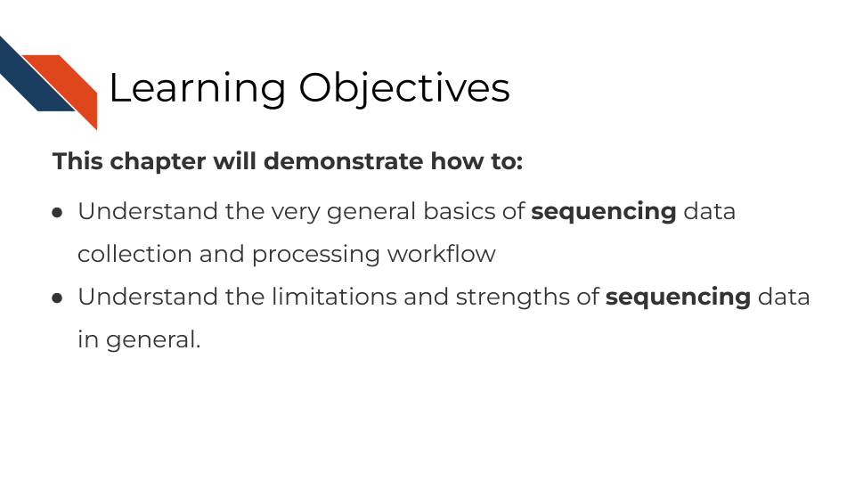
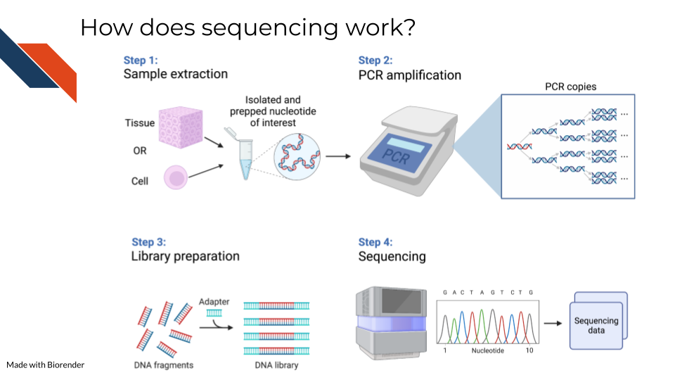
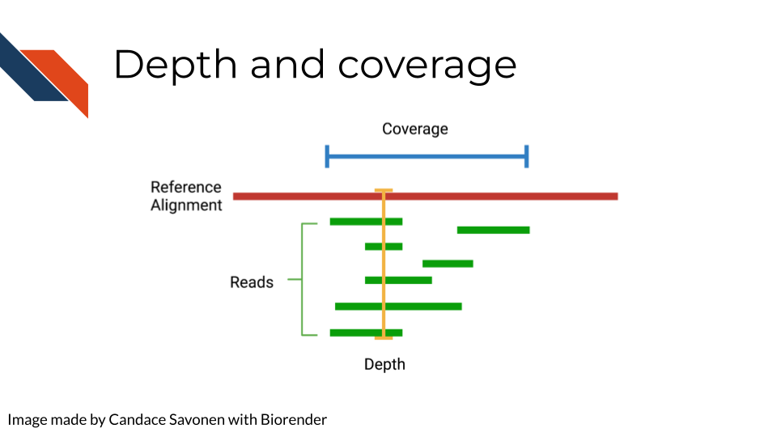
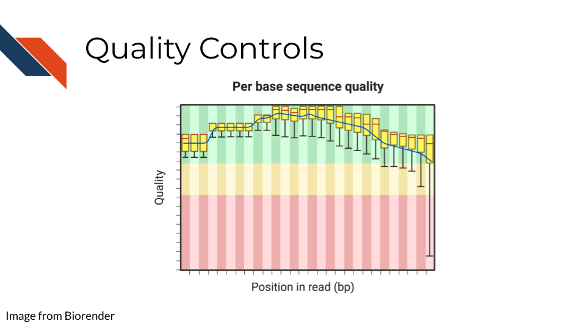
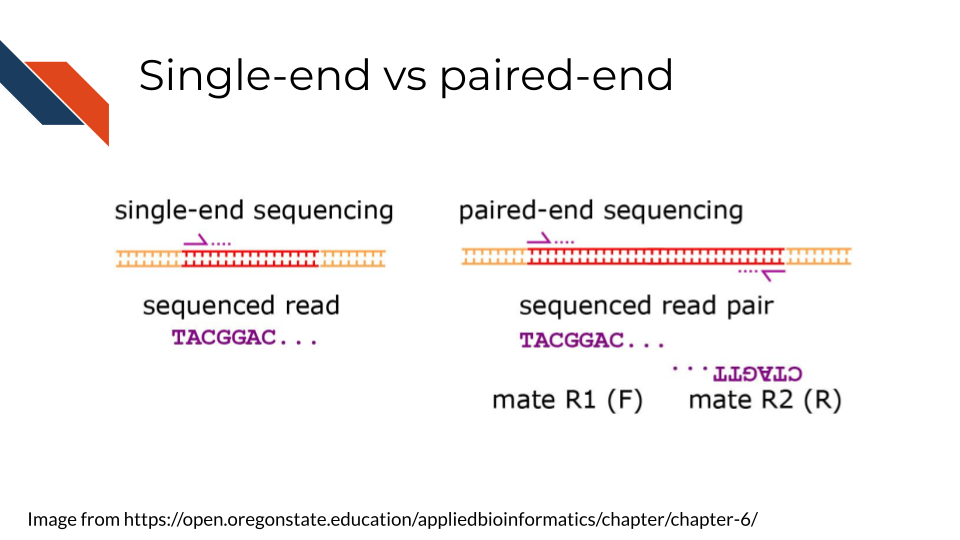

# Sequencing Data

<div class = "warning">
This chapter is in a beta stage. If you wish to contribute, please [go to this form](https://forms.gle/dqYgmKH8XXE2ohwD9) or our [GitHub page](https://github.com/fhdsl/Choosing_Genomics_Tools).
</div>

## Learning Objectives



In this section, we are going to discuss generalities that apply to all sequencing data. This is meant to be a "primer" for you which data-type specific chapters will build off of to give you more specific and practical steps and advice in regards to your data type.

## How does sequencing work?



Sequencing methods, whether they are targeting DNA, transcriptomes, or some other target of the genome, have some commonalities in the steps as well as what types of biases and data generation artifacts to look out for.

All sequencing experiments start out with the extraction of the biological material of interest. This biological material will be processed in some way to isolate to the genomic target of interest (we will cover the various techniques for this in more detail in each respective data chapter since it is highly specific to the data type).

This set of processing steps will lead up to library generation -- adding a way to catalog what molecules came from where. Sometimes for this library prep the sequences need to be fragmented before hand and an adapter bound to them.

The resulting sample material is often a very small quantity, which means Polymerase Chain Reaction (PCR) needs to be used to amplify the material to a quantity large enough to be reliably sequenced. We will talk about how this very common method not only amplifies the sequences we want to read but amplifies sequence method biases that we would like to avoid.

At the end of this process, base sequences are called for the samples (with varying degrees of confidence), creating huge amounts of data and what hopefully contains valuable research insights.  

## Sequencing concepts

### Inherent biases


Sequences are not all sequenced or amplified at the same rate. In a perfect world, we could take a simple snapshot of the genome we are interested in and know exactly what and how many sequences were in a sample. But in reality, sequencing methods and the resulting data always have some biases we have to be aware of and hopefully use methods that attempt to mitigate the biases.

#### GC bias

You may recall that with nucleotides: adenine binds with thymine and guanine binds with cytosine. But, the guanine-cytosine bond (GC) has 3 hydrogen bonds whereas the adenine-thymine bond (AT) has only 2 bonds. This means that the GC bond is stickier (to put it scientifically) and needs higher temperatures to unbind. The sequencing and PCR amplification process involves cycling through temperatures and binding and unbinding of sequences which means that if a sequence has a lot of G's and C's (high GC content) it will unbind at a different temperatures than a sequence of low GC content.

#### Sequence complexity

Nonrepeating sequences are harder to sequence and amplify than repeating sequences. This means that the complexity of a target sequence influences the PCR amplification and detection.

#### Length bias

Longer sequences -- whether they represent long sequence variants, long transcripts, or etc, are more likely to be identified than shorter ones! So if you are attempting to quantify the presence of a sequence, a longer sequence is much more likely to be counted more often.

### PCR Amplification

All of the above biases are amplified when the sequences are being amplified! You can picture that if each of these biases have a certain effect for one copy, then as PCR steps copy the sequence exponentially, the error is also being multiplied! PCR amplification is generally a necessary part of the process. But there are tools that allow you to try to combat the biases of PCR amplification in your data analysis. These tools will be dependent on the type of sequencing methods you are using and will be something that is discussed in each data type chapter.

### Depth of coverage



The depth of sequencing refers to how many times on average a particular base is sequenced. Obviously the more times something is sequenced, the more you can be confident that the base call is accurate. However, sequencing at greater depths also takes more time and money. Depending on your sequencing goals and methods there is an appropriate level of depth that is needed.

Coverage on the other hand has to do with how much of the target is covered. If you are doing Whole Genome Sequencing, what percentage of the whole genome were you able to sequence? You may realize how depth is related to coverage, in that the greater depth of sequencing you use the more likely you are to also cover more of the genome. As discussed in relation to the biases, some part of the genome are harder to reach than others, so by reading at greater depths some of those "hard to read" parts of the genome will be able to be covered.

### Quality controls



Sequencing bases involves some error/confidence rate. As mentioned, some parts of the genome are harder to read than others. Or, sometimes your sequencing can be influenced by poor quality sample that has degraded. Before you jump in to further analyzing your data, you will want to investigate the quality of the sequencing data you've collected.

The most common and well-known method for assessing sequencing quality controls is [FASTQC](https://www.bioinformatics.babraham.ac.uk/projects/fastqc/). FASTQC creates an abundance of sequencing quality control reports from fastq files. These reports need to be interpreted within the context of your sequencing methods, samples, and experimental goals. Often bioinformatics cores are good to contact about these reports (they may have already run FASTQC on your data if that is where you obtained your data initially). They can help you wade through the flood of quality control reports printed out by FASTQC.

FASTQC also has great documentation that can attempt to guide you through report interpretation. This also includes examples of good and bad FASTQC reports. But note that all FASTQC report interpretations must be done relative to the experiment that you have done. In other words, there is not a one size fits all quality control cutoffs for your FASTQC reports. The failure/success icons FASTQC reports back are based on defaults that may not be accurate or applicable to your data, so further investigation and consultation is warranted before you decided to trust or pitch your sequencing data.

### Alignment


Once you have your reads and you find them reasonably trustworthy through quality control checks, you will want to align them to your reference. The reference you align your sequences to will depend on the data type you have: a reference genome, a reference transcriptome, something else?

- Traditional aligners - Align your data to a reference using standard alignment algorithms. Can be very computationally intensive.
- Pseudo aligners - much faster and the trade off for accuracy is often negligible (but again is dependent on the data you are using).

TODO: considerations for alignment.

### Single End vs Paired End



Sequencing can be done single-end or paired-end. Paired end means the primers are going to bind to both sides of a sequence. This can help you avoid some 3' bias and give you more complete coverage of the area you are sequencing. But, as you may guess, pair-end read sequencing is more expensive than single end.

You will want to determine whether your sequencing is paired end or single end. If it is paired end you will likely see file names that indicate this. You should have pairs of files that may or may not be labeled with `_1` and `_2` or `_F` and `_R`. We will discuss file nomenclature more specifically as it pertains to different data types in the upcoming chapters.

## Very General Sequencing Workflow

In the data type specific chapters, we will cover the sequencing data workflows and file formats in more detail. But in the most general sense, sequencing workflows look like this:

<div id="04D1599E33D92E370515664A58E78BE1EEB_69816"><div id="04D1599E33D92E370515664A58E78BE1EEB_69816_robot"><a href="https://cloud.smartdraw.com/share.aspx/?pubDocShare=04D1599E33D92E370515664A58E78BE1EEB" target="_blank"></a></div></div><script src="https://cloud.smartdraw.com/plugins/html/js/sdjswidget_html.js" type="text/javascript"></script><script type="text/javascript">SDJS_Widget("04D1599E33D92E370515664A58E78BE1EEB",69816,1,"");</script><br/>

### Sequencing file formats

#### SAM - Sequence Alignment Map
SAM Files are text based files that have sequence information. It generally has not been quantified or mapped. It is the reads in their raw form. [For more about SAM files](https://samtools.github.io/hts-specs/SAMv1.pdf).

#### BAM - Binary Alignment Map
BAM files are like SAM files but are compressed (made to take up less space on your computer). This means if you double click on a BAM file to look at it, it will look jumbled and unintelligible. You will need to convert it to a SAM file if you want to see it yourself (but this isn't necessary necessarily).

#### FASTA - "fast A"

Fasta files are sequence files that can be either nucleotide or amino acid sequences. They look something like this (the example below illustrating an amino acid sequence):

```
>SEQ_ID
GATTTGGGGTTCAAAGCAGTATCGATCAAATAGTAAATCCATTTGTTCAACTCACAGTTT
```

For [more about fasta files](https://en.wikipedia.org/wiki/FASTA_format).

#### FASTQ - "Fast q"

A Fastq file is like a Fasta file except that it also contains information about the **Q**uality of the read. By quality, we mean, how sure was the sequencing machine that the nucleotide or amino acid called was indeed called correctly?

```
@SEQ_ID
GATTTGGGGTTCAAAGCAGTATCGATCAAATAGTAAATCCATTTGTTCAACTCACAGTTT
+
!''*((((***+))%%%++)(%%%%).1***-+*''))**55CCF>>>>>>CCCCCCC65
```

For [more about fastq files](https://en.wikipedia.org/wiki/FASTQ_format).

Later in this course we will discuss the importance of examining the quality of your sequencing data and how to do that. If you received your data from a bioinformatics core it is possible that they've already done this quality analysis for you.

_Sequencing data that is not of high enough quality should not be trusted!_ It may need to be re-run entirely or may need extra processing (trimming) in order to make it more trustworthy. We will discuss this more in later chapters.

#### BCL - binary base call (BCL) sequence file format

This type of sequence file is specific to Illumina data. In most cases, you will simply want to convert it to Fastq files for use with non-Illumina programs.

[More about BCL to Fastq conversion](https://medium.com/@marija190396/bcl-to-fastq-conversion-e289852823d0).

#### VCF - Variant Call Format

VCF files are further processed form of data than the sequence files we discussed above. VCF files are specially for storing only where a particular sample's sequences differ or are _variant_ from the reference genome or each other.

This will only be pertinent to you if you care about DNA variants. We will discuss this in the DNA seq chapter.

For [more on VCF files](https://en.wikipedia.org/wiki/Variant_Call_Format).

#### MAF - Mutation Annotation Format

MAF files are aggregated versions of VCF files. So for a group of samples for which each has a VCF file, your entire group of samples' variants will be summarized in the form of a MAF file.

For [more on MAF files](https://docs.gdc.cancer.gov/Data/File_Formats/MAF_Format/#:~:text=Mutation%20Annotation%20Format%20(MAF)%20is,(or%20open%2Daccess).).

### Other files

\* If you didn't see a file type listed you are looking for, take a look at this [list by the BROAD](https://software.broadinstitute.org/cancer/software/gsea/wiki/index.php/Data_formats). Or, it may be covered in the data type specific chapters.
