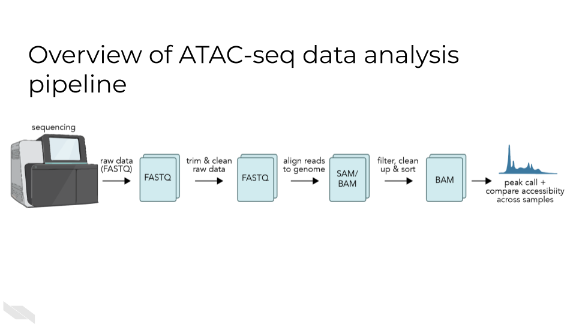

# ATAC-Seq

This chapter is incomplete! If you wish to contribute, please [go to this form](https://forms.gle/dqYgmKH8XXE2ohwD9) or our [GitHub page](https://github.com/fhdsl/Choosing_Genomics_Tools).

## Learning Objectives

## What are the goals of ATAC-Seq analysis?

The goals of ATAC-seq are to identify the accessible regions of the genome in a particular set of samples. These data allow us to understand the relationships between the chromatin accessibility patterns and cell states, and to understand the mechanistic causes and consequences of these chromatin accessibility patterns.  

ATAC-seq data is generated by fragmenting the genome with the Tn5 endonuclease and sequencing the shorter DNA fragments. While most of the genome is associated with protein complexes that preclude the digestion of DNA by Tn5, some regions of the genome have accessible chromatin that can be cleaved by Tn5 resulting in short (<500bp) fragments. These regions of the genome are of biological interest as they are likely to harbor transcription factor binding sites and to constitute cis-regulatory elements, genomic regions that are involved in the regulation of gene expression.

### What questions can be answered with ATAC-seq?

## ATAC-Seq general workflow overview

A basic ATAC-seq workflow involves mapping sequence reads to the genome, identifying peaks, assessing data quality, and identifying patterns of interest through clustering or identification of differentially accessible regions or other statistical means.

### Data quality metrics:

#### Pre-sequencing QC:

#### Sequencing considerations:

#### Pre-alignment QC:

A tool like FastQC or similar should be used to check for GC content, read quality and length, and primer or adapter reads prior to alignment. Trimmomatic is a useful tool for removing primer and adapter sequences if they are present. ATAC-seq experiments should be sequenced with paired-end sequencing, and existing pipelines will expect paired-end. (2 files *_R1.fastq and *_R2.fastq)

- Use fasterq-dump to download files from NCBI Sequence Read Archive - this tool will automatically split the reads in multiple files

#### Number of mapped reads

As for all DNA-sequencing based genomics technologies, a sufficient number of mapped reads is required to obtain meaningful results from a sample. You can read more about [general sequencing technologies in our previous chapter here](http://hutchdatascience.org/Choosing_Genomics_Tools/sequencing-data.html). For experiments on human samples this number should be greater than 20 million mapped unique reads.

[Bowtie2](https://bowtie-bio.sourceforge.net/index.shtml) is commonly used for mapping fragments to the genome.

As for all DNA-sequencing based genomics technologies, a sufficient number of mapped reads is required to obtain meaningful results from a sample. You can read more about [general sequencing technologies in our previous chapter here](http://hutchdatascience.org/Choosing_Genomics_Tools/sequencing-data.html). For experiments on human samples this number should be greater than 20 million mapped unique reads.

#### Post-alignment QC:

Post alignment: check percent of matched, unmatched, unpaired and duplicated reads. Reads which are duplicated or unmatched should be filtered out.
[Picard](https://broadinstitute.github.io/picard/) is a useful tool for this step.
Reads on the + strand should be shifted +4bp, reads on the - strand should be shifted -5 bp.

#### Fragment size distribution:

ATAC-seq data is often generated using paired end sequencing technologies, which allow for characterization of ATAC-seq fragments. Histograms of these distributions using single base pair resolution bins reveal patterns of enrichment relative to the nucleosome scale of 147bp and the DNA-helix scale ~10.5bp.

When comparing ATAC-seq samples, it is important to consider the fragment size distributions of the samples being compared. Differences in the distributions could lead to results that are unrelated to biology.

#### Peak calling:

ATAC-seq peak calling typically makes use of analysis tools developed for ChIP-seq. MACS2 is one of the most common choices for a peak calling tool, but HOMER or other common ChIP-seq peak callers are also acceptable.
An input sample is not typically generated for ATAC-seq as it would be for a ChIP-seq experiment, so the major requirement for the peak caller is that it does not require the input control to call peaks.

#### Number of peaks:

Although the number of accessible chromatin regions can vary from one cell type to another, there are several regions that appear to be constitutively accessible across most cell types. At least 20,000 peaks can be identified in a high quality experiment.  The deeper the sequencing the more peaks will be detected in an ATAC-seq experiments. At a very high sequencing depth some of the statistically significant peaks might not be of biological interest. In an analysis of such data sets the fold enrichment relative to background, or absolute peak signal, in addition to statistical significance, ought to be taken into account.

#### FRiP score (fraction of reads in peaks)

In high quality ATAC-seq data a large fraction of reads overlap with peaks, while in low quality data there is a high level of fragments that map to background regions. Ideally, the FRiP score is greater than 0.3 (30 percent or more of reads overlap with peaks), with a score below 0.2 indicating low-quality data
<Slide>

#### Overlap with other chromatin accessibility data

Thousands of ATAC-seq samples have been produced in human and mouse. High quality ATAC-seq data will share a substantial proportion of peaks with many of these datasets. Publicly available ATAC-seq data can be found and comparisons made at the Cistrome Data Browser [http://cistrome.org/db/].

#### Overlap with promoters

The promoter regions of many genes are constitutively accessible. Examining peak overlap with regions close to known protein coding gene transcription start sites can be used as a check for data quality.

### Information from ATAC-seq analysis:

#### Major approaches:

- Compare changes in transcription factor motif enrichment in accessible regions between samples
- Compare changes in accessibility of regions (differential accessibility) between samples
- Footprinting - identify regions where insertion is below expected level

#### Differential accessibility analysis:

Differential accessibility analysis typically uses packages for RNA-seq differential expression analysis such as  DEseq2, edgeR, or limma. 

All three are available as R packages and can be installed using Bioconductor, a bioinformatics package manager for R. Unfortunately, there are no well-established packages for this analysis in other languages such as Python. Differential accessibility analysis is an approach with high potential, but care must be taken in processing and normalizing the data for accurate results.

#### Motif analysis:

Motif analysis in ATAC-seq is more complex than for ChIP-seq because a larger set of TFs are responsible for the emergence of chromatin accessible regions than for the binding sites of a particular TF. Nevertheless, in the analysis of differential ATAC-seq peaks motif analysis can be used to reveal the TFs related to differences between conditions. This type of analysis is most likely to be successful when the ATAC-seq between closely related conditions or cell types is being compared.

[The MEME suite](https://meme-suite.org/meme/) has a variety of tools for motif analysis available in both web and command-line versions.

#### Motif Scanning

Motif scanning is an analysis technique which identifies putative transcription factor binding sites (TFBS) which sufficiently match a given TF motif’s position-weight matrix.  PWMscan is a straightforward online tool, but not the best option for high throughput. FIMO is an alternative which can be used either on the web or the command line. This approach will identify all sites within the genome which are likely to bind a single transcription factor.

#### Motif discovery:

Homer or MEME. These tools identify overrepresented sequences within the accessible peaks, regardless of whether they match a previously defined motif.
Once the ATAC-seq peaks are determined, the next step is to search for enriched DNA sequence motifs within these regions. This is accomplished by using motif discovery algorithms such as MEME Suite, HOMER, or DREME. These tools scan the ATAC-seq peaks for overrepresented sequence patterns, which may correspond to binding sites for specific transcription factors or other regulatory elements. The motifs discovered can be compared against existing motif databases, such as JASPAR or TRANSFAC, to annotate the potential transcription factor binding sites.

#### Motif Enrichment:

These motif enrichment tools will scan through and identify matches to known motif sequences within accessible sites, and additionally will quantify whether the motif is significantly enriched compared to a control sample (input, uncommon with ATAC-seq) or a shuffled sequence to mimic background.

After identifying the enriched motifs, researchers can perform motif enrichment analysis to determine the significance of these motifs in the ATAC-seq peaks. This is often done using statistical tools like Fisher's exact test or hypergeometric test, which assess the enrichment of specific motifs compared to their background occurrence in the genome. Additionally, tools like GREAT or HOMER can be employed to perform gene ontology analysis and assess the functional relevance of the identified motifs in biological processes and pathways.

Overall, ATAC-seq motif enrichment analysis provides researchers with valuable insights into the regulatory landscape of the genome. By identifying enriched motifs within accessible chromatin regions, researchers can gain a deeper understanding of the transcriptional regulatory networks and potentially uncover novel transcription factors involved in specific biological processes or diseases. This analysis serves as a powerful tool for unraveling the intricacies of gene regulation and can pave the way for further investigations in functional genomics and therapeutic development.
Homer or MEME suite tools.

## ATAC-Seq data **strengths**:

- The ATAC-seq is easy to adopt and has been  used by many laboratories to generate high quality data for characterizing accessible chromatin in cell lines or sorted cells derived from tissues.
- In principle, ATAC-seq can identify a large proportion of cis-regulatory elements.
- In contrast to ChIP-seq, ATAC-seq does not require specific antibodies- ATAC-seq is a time-efficient protocol which requires low cell input.
- In comparison with histone modification ChIP-seq, ATAC-seq provides a higher resolution assessment of the cis-regulatory genomic regions. Histone modification ChIP-seq, in contrast, tends to be localized on nucleosomes flanking the site of interest and can spread to nucleosomes beyond the immediate flanking ones.

## ATAC-Seq data **limitations**:

- ATAC-seq does not precisely identify the  transcription factors or other chromatin associated factors that bind in or around chromatin accessible regions. This type of information needs to be inferred through analysis of transcription factor binding motif analysis or ChIP-seq data.
- Whereas ATAC-seq indicates the presence of a putative cis-regulatory element, H3K27ac ChIP-seq is able to separate accessible regions from those that are accessible and active.
- Accessible regions are not necessarily cis-regulatory regions, although many of them are.
- The genes that are regulated by cis-regulatory elements cannot be identified conclusively by ATAC-seq alone.
- ATAC-seq data can be biased, and affected by batch effects like any other genomics data type. When comparing ATAC-seq data good experimental design principles like the inclusion of biological replicates and consideration of controls, are needed for a meaningful outcome.  .

## ATAC-Seq data considerations

The nucleosome is the fundamental unit of chromatin packaging in the genome and nucleosomal DNA is far less likely to be cleaved by the Tn5 nuclease than linker DNA. When DNA is fragmented by Tn5 the positions of the endpoints relative to the nucleosomes is an important consideration. When the ends are less than 147bp apart it is likely that both ends originate from the same linker region. Longer fragments can result from cuts on opposite sides of the same nucleosome, or even opposite sides of a genomic interval that encompasses multiple nucleosomes. The short fragments are therefore most likely to be nucleosome free and provide stronger evidence for transcription factor binding sites.

As will other genomics protocols, ATAC-seq data is subject to biases introduced in the ATAC-seq protocol and in the sequencing itself. Comparison of ATAC-seq data generated in different batches, by different laboratories or using different protocols might not be directly comparable. In addition, the Tn5 endonuclease does have biases in the precise DNA sequences it can cut. This should be taken into consideration when carrying out base pair resolution analyses including footprinting analysis and analysis of the effects of sequence variants on chromatin accessibility.   

Read depth will impact ATAC-seq signal, but enzyme strength and conditions can also alter the distribution of cuts.

When using ATAC-seq data to answer biological questions it is important to understand what types of bias could impact the results. To ensure valid results the analysis needs to use appropriate statistical methods, ensure enough high quality ATAC-seq data is available, including controls, and possibly reframing the questions.

## ATAC-seq analysis tools

This section has been written by AI and needs verification by experts. This is meant to give you a basic idea of the pros and cons of these tools but should ultimately be used with your own judgment.

- [MACS2](https://github.com/macs3-project/MACS)[@zhang2008model]:
  - **Pros**: widely used, handles both paired-end and single-end sequencing data, allows for differential peak calling between different samples.
  - **Cons**: assumes that all peaks have the same shape, may not be as accurate as other peak-calling tools in some cases.

- [HOMER](http://homer.ucsd.edu/homer/introduction/programs.html)[@heinz2010simple]:
  - **Pros**: includes tools for peak-calling, motif analysis, and annotation of nearby genes, user-friendly interface, handles both paired-end and single-end sequencing data.
  - **Cons**: may not be as accurate as other peak-calling tools in some cases.

- [ATACseqQC](https://bioconductor.org/packages/release/bioc/html/ATACseqQC.html)[@schep2017chromvar]:
  - **Pros:** provides several metrics and plots for evaluating data quality, identifies potential issues with data such as batch effects, sequencing depth, and library complexity.
  - **Cons**: does not perform peak-calling or downstream analysis.

- [deeptools](https://deeptools.readthedocs.io/en/develop/)[@ramirez2016deeptools2]:
  - **Pros**: includes tools for normalization, visualization, and comparison of ATAC-seq data, generates heatmaps, profiles, and other plots for visualizing chromatin accessibility.
  - **Cons**: may require some programming skills to use effectively.

- [DFilter](https://reggenlab.github.io/DFilter/tutorial.html) [@ghavi2019highly]:
  - **Pros**: uses a deep learning approach to predict the likelihood of a genomic region being an ATAC-seq peak, can handle both paired-end and single-end sequencing data, has been shown to outperform other peak-calling tools in some cases.
  - **Cons**: may require more computational resources than other tools.

## Additional tutorials and tools

This section has been written by AI and needs verification by experts. This is meant to give you a basic idea of the pros and cons of these tools but should ultimately be used with your own judgment.

- [MACS2](https://github.com/macs3-project/MACS)[@zhang2008model]:
  - **Pros**: widely used, handles both paired-end and single-end sequencing data, allows for differential peak calling between different samples.
  - **Cons**: assumes that all peaks have the same shape, may not be as accurate as other peak-calling tools in some cases.

- [HOMER](http://homer.ucsd.edu/homer/introduction/programs.html)[@heinz2010simple]:
  - **Pros**: includes tools for peak-calling, motif analysis, and annotation of nearby genes, user-friendly interface, handles both paired-end and single-end sequencing data.
  - **Cons**: may not be as accurate as other peak-calling tools in some cases.

- [ATACseqQC](https://bioconductor.org/packages/release/bioc/html/ATACseqQC.html)[@schep2017chromvar]:
  - **Pros:** provides several metrics and plots for evaluating data quality, identifies potential issues with data such as batch effects, sequencing depth, and library complexity.
  - **Cons**: does not perform peak-calling or downstream analysis.

- [deeptools](https://deeptools.readthedocs.io/en/develop/)[@ramirez2016deeptools2]:
  - **Pros**: includes tools for normalization, visualization, and comparison of ATAC-seq data, generates heatmaps, profiles, and other plots for visualizing chromatin accessibility.
  - **Cons**: may require some programming skills to use effectively.

- [DFilter](https://reggenlab.github.io/DFilter/tutorial.html) [@ghavi2019highly]:
  - **Pros**: uses a deep learning approach to predict the likelihood of a genomic region being an ATAC-seq peak, can handle both paired-end and single-end sequencing data, has been shown to outperform other peak-calling tools in some cases.
  - **Cons**: may require more computational resources than other tools.

## Additional tutorials and tools

- [A Galaxy based tutorial for ATAC-seq](https://training.galaxyproject.org/training-material/topics/epigenetics/tutorials/atac-seq/tutorial.html) - Galaxy is a good recommendation for those new to informatics who would like a cloud-based GUI option to use for the analysis of their data.
- [MACS - Model-based analysis for ChIP-Seq](https://macs3-project.github.io/MACS/) - A command line tool for the identification of transcription factor binding sites. Can be used with ChIP-seq or ATAC-seq.
- [CHIPS](https://github.com/liulab-dfci/CHIPS) - A Snakemake pipeline for quality control and reproducible processing of chromatin profiling data. This tool will require some snakemake and coding knowledge. For more recommendations about coding see our later chapter about [general data analysis tools]().
- [Cistrome DB](http://cistrome.org/db/#/) - a visual tool to allow you to browse your ATAC-seq data.
- [SELMA - Simplex Encoded Linear Model for Accessible Chromatin](https://github.com/zang-lab/SELMA) - SELMA is a python based tool for the assessment of biases in Chromatin based data.  

## Online Visualization tools

- [Cistrome DB](http://cistrome.org/db/#/) - a visual tool to allow you to browse your ATAC-seq data.
- [UCSC Xena](http://xena.ucsc.edu/) is a web-based visualization tool for multi-omic data and associated clinical and phenotypic annotations. It can be used with ATAC-seq data.
- [Integrative Genomics Viewer (IGV)](https://software.broadinstitute.org/software/igv/) is a track-based browser for interactively exploring genomic data mapped to a reference genome.

## More resources about ATAC-seq data

- [ATAC-seq overview from Galaxy](https://training.galaxyproject.org/training-material/topics/epigenetics/tutorials/atac-seq/slides.html#1) - these slides explain the overarching concepts of ATAC-seq.
- [ATAC seq guidelines from Harvard](https://informatics.fas.harvard.edu/atac-seq-guidelines.html) - this workflow runs through step by step how to analysis ATAC-seq data and what different parameters mean.
- [ATAC-seq review](https://genomebiology.biomedcentral.com/articles/10.1186/s13059-020-1929-3) - this paper gives a great overview of ATAC-seq data and step by step what needs to be considered.
- [Identifying and mitigating bias in chromatin](https://www.ncbi.nlm.nih.gov/pmc/articles/PMC4473780/)
- [CHIP Snakemake pipeline for analyzing ChIP-seq and chromatin accessibility data](https://f1000research.com/articles/10-517)
- [Paper on bias in DNase-seq footprinting analysis and fragment size effects, similar comments apply to ATAC-seq](https://www.ncbi.nlm.nih.gov/pmc/articles/PMC4018771/)
- [SELMA Method for evaluating footprint bias in ATAC-seq](https://www.ncbi.nlm.nih.gov/pmc/articles/PMC9492688/)
