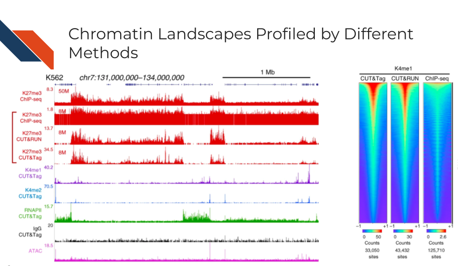

# CUT&RUN and CUT&Tag

<div class = "warning">
This chapter is in a beta stage. If you wish to contribute, please [go to this form](https://forms.gle/dqYgmKH8XXE2ohwD9) or our [GitHub page](https://github.com/fhdsl/Choosing_Genomics_Tools).
</div>

## Learning Objectives


## Technologies


## Advantages of CUT&RUN and CUT&Tag over the Traditional ChIP-seq Technology

- **Lower Cell Number and Less Starting Material Requirement**: CUT&RUN and CUT&Tag can be performed with much lower cell number than ChIP-seq. This is particularly beneficial when working with rare cell types or limited biological samples. The CUT&RUN and CUT&Tag techniques involve less sample manipulation compared to ChIP-seq. This minimizes the risk of losing material and potential artifacts from extensive sample handling and processing.


- **Higher Resolution and Specificity**: CUT&RUN and CUT&Tag provide higher resolution and greater specificity in identifying protein-DNA interactions. This results from the method's direct targeting and cleavage of DNA at the binding sites, reducing background noise.


- **Reduced Background Noise**: CUT&RUN and CUT&Tag typically result in lower background noise due to the direct tagging of DNA at the site of the protein-DNA interaction, enhancing the clarity and quality of the results. The sensitivity of sequencing depends on the depth of the sequencing run (i.e., the number of mapped sequence tags), the size of the genome, and the distribution of the target factor. The sequencing depth is directly correlated with cost and negatively correlated with background. Therefore, low-background CUT&RUN and CUT&Tag will waste less sequencing resources on profiling the background and hence is inherently more cost-effective than high-background ChIP-seq.



- **Cost-Effectiveness**: In addition to high efficiency in sequencing the target region, due to the lower requirement for reagents and enzymes, CUT&RUN and CUT&Tag can be more cost-effective, especially in high-throughput settings.

- **More Efficient Protocol Workflow and Faster Turnaround Time**: The protocol for CUT&RUN and CUT&Tag is more streamlined and less labor-intensive than ChIP-seq. It eliminates the need for sonication, DNA purification, and ligation steps, simplifying the procedure. The overall protocols of CUT&RUN and CUT&Tag are generally quicker and more straightforward than ChIP-seq, leading to faster experiment turnaround times.


### CUT&RUN

**Cleavage Under Targets and Release Using Nuclease**, **CUT&RUN** for short, is an antibody-targeted chromatin profiling method to measure the histone modification enrichment or transcription factor binding. This is a more advanced technology for epigenomic landscape profiling compared to the tradditional ChIP-seq technology and known for its easy implementation and low cost.  The procedure is carried out in situ where micrococcal nuclease tethered to protein A binds to an antibody of choice and cuts immediately adjacent DNA, releasing DNA-bound to the antibody target. Therefore, CUT&RUN produces precise transcription factor or histone modification profiles while avoiding crosslinking and solubilization issues. Extremely low backgrounds make profiling possible with typically one-tenth of the sequencing depth required for ChIP-seq and permit profiling using low cell numbers (i.e., a few hundred cells) without losing quality.

<!-- [Henikoff lab](https://research.fredhutch.org/henikoff/en.html) constructed a 6xHis and HA-tagged protein A-protein G-MNase fusion (pAG-MNase) that allows direct binding of mouse antibodies that bind poorly to protein A, eliminating the need for a secondary antibody. The His tag allows the purification of pAG-MNase with a commercial kit, while the HA tag can be used for pulling out pAG-MNase chromatin complexes for CUT&RUN.ChIP. Henikoff lab developed low salt and high calcium conditions that prevent diffusion of released complexes into the supernatant, allowing for longer digestion times and increased yields without increased cleavage at non-specific accessible sites. E. coli DNA carried over from pA-MNase or pAG-MNase preparation is sufficient for internal calibration of samples without adding heterologous spike-in DNA. -->


- Publications:

1. [An efficient targeted nuclease strategy for high-resolution mapping of DNA binding sites. eLife. 2017](https://elifesciences.org/articles/21856)
2. [Targeted in situ genome-wide profiling with high efficiency for low cell numbers. Nature Protocols. 2018](https://www.nature.com/articles/nprot.2018.015)
3. [Improved CUT&RUN chromatin profiling tools. eLife. 2019](https://elifesciences.org/articles/46314)

- Protocols:

1. [CUT&RUN: Targeted in situ genome-wide profiling with high efficiency for low cell numbers (Version 3)](https://www.protocols.io/view/cut-amp-run-targeted-in-situ-genome-wide-profiling-14egnr4ql5dy/v3)
2. [CUT&RUN with Drosophila tissues (Version 1)](https://www.protocols.io/view/cut-run-with-drosophila-tissues-14egnx28pl5d/v1)

#### AutoCUT&RUN

CUT&RUN has been automated using a Beckman Biomek FX liquid-handling robot so that a 96-well format can be used to profile chromatin for high-throughput samples, such as in a clinical setting. DNA end polishing and direct ligation of adapters permit sample-to-Illumina library processing of 96 samples in two days. AutoCUT&RUN can be used for cell-type specific gene activity and enhancer profiling based on histone modifications and transcription factors, including in frozen tissue samples of tumor xenografts.

- Publication:

1. [Automated in situ chromatin profiling efficiently resolves cell types and gene regulatory programs. Epigentics & Chromatin. 2018](https://epigeneticsandchromatin.biomedcentral.com/articles/10.1186/s13072-018-0243-8)

- Protocol:

1. [AutoCUT&RUN: genome-wide profiling of chromatin proteins in a 96 well format on a Biomek (Version 1)](https://www.protocols.io/view/autocut-run-genome-wide-profiling-of-chromatin-pro-6qpvre6zblmk/v1)

### CUT&Tag

**Cleavage Under Targets and Tagmentation**, **CUT&Tag** for short, is an enzyme tethering approach to profiling chromatin proteins, including histone marks and RNA Pol II. CUT&Tag generates sequence-ready libraries without the need for end polishing and adaptor ligation. It uses a proteinA-Tn5 fusion to tether Tn5 transposase near the site of an antibody to a chromatin protein of interest. A secondary antibody, such as guinea pig anti-rabbit antibody, is used to increase the efficiency of tethering the pA-Tn5 to the target primary antibody. The pA-Tn5 complex is pre-loaded with sequencing adapters that insert into adjacent DNA upon activation with magnesium. CUT&Tag has a very low background and can be performed in a single tube in as little as a day, though primary antibodies are typically incubated overnight. It can also be used with the ICELL8 nano dispensation system to profile single cells.

A streamlined CUT&Tag protocol was introduced by the [Henikoff Lab](https://research.fredhutch.org/henikoff/en.html) that suppresses DNA accessibility artifacts to ensure high-fidelity mapping of the antibody-targeted protein and improves the signal-to-noise ratio over current chromatin profiling methods. Streamlined CUT&Tag can be performed in a single PCR tube, from cells to amplified libraries, providing low-cost genome-wide chromatin maps. By simplifying library preparation, CUT&Tag-direct requires less than a day at the bench, from live cells to sequencing-ready barcoded libraries. As a result of low background levels, barcoded and pooled CUT&Tag libraries can be sequenced for as little as $25 per sample. This enables routine genome-wide profiling of chromatin proteins and modifications and requires no special skills or equipment.  


- Publication:

1. [CUT&Tag for efficient epigenomic profiling of small samples and single cells. Nature Communications. 2019](https://www.nature.com/articles/s41467-019-09982-5)
2. [Efficient low-cost chromatin profiling with CUT&Tag. Nature Protocols. 2020](https://www.nature.com/articles/s41596-020-0373-x)
3. [Scalable single-cell profiling of chromatin modifications with sciCUT&Tag. Nature Protocols. 2023](https://www.nature.com/articles/s41596-023-00905-9)

- Protocol:

1. [Bench top CUT&Tag (Version 3)](https://www.protocols.io/view/bench-top-cut-amp-tag-kqdg34qdpl25/v3)
2. [3XFlag-pATn5 Protein Purification and MEDS-loading (5x scale, 2L volume, Version 1)](https://www.protocols.io/view/3xflag-patn5-protein-purification-and-meds-loading-j8nlke4e5l5r/v1)
3. [CUT&Tag with Drosophila tissues (Version 1)](https://www.protocols.io/view/cut-tag-with-drosophila-tissues-3byl4kkprvo5/v1)

#### AutoCUT&Tag

CUT&Tag has been automated using a Beckman Coulter Biomek FX liquid handling robot so that a 96-well format can be used to profile chromatin for high-throughput samples, such as in a clinical setting. AutoCUT&Tag can be used to profile the gene targets of fusions of the KMT2A lysine methyltransferase to other chromatin proteins, which characterize lymphoid, myeloid, and mixed lineage leukemias, uncovering heterogeneities that may underlie lineage plasticity.

- Publication:

1. [Automated CUT&Tag profiling of chromatin heterogeneity in mixed-lineage leukemia. Nature Genetics. 2021](https://www.nature.com/articles/s41588-021-00941-9)
2. [Simplified Epigenome Profiling Using Antibody-tethered Tagmentation](https://en.bio-protocol.org/en/bpdetail?id=4043&type=0)
3. [Epigenomic analysis of formalin-fixed paraffin-embedded samples by CUT&Tag](https://www.nature.com/articles/s41467-023-41666-z)

- Protocol:

1. [AutoCUT&Tag: streamlined genome-wide profiling of chromatin proteins on a liquid handling robot (Version 1)](https://www.protocols.io/view/autocut-amp-tag-streamlined-genome-wide-profiling-14egn819qg5d/v1)

#### CUTAC

Cleavage Under Targeted Accessible Chromatin, CUTAC, for short, is a simple modification of the Tn5 transposase-mediated antibody-directed CUT&Tag method that provides high-quality accessibility mapping in parallel with mapping of specific components of the chromatin landscape. Findings imply that regulatory sites detected by hyperaccessibility mapping are coupled to the initiation of RNA Polymerase II transcription via H3K4 methylation. CUTAC requires few resources and is sufficiently simple that it can be performed from nuclei to purified sequencing-ready libraries in single PCR tubes on a home workbench.


- Publication:

1. [Efficient chromatin accessibility mapping in situ by nucleosome-tethered tagmentation. eLife. 2020](https://elifesciences.org/articles/63274)

- Protocol:

1. [CUT&Tag-direct for whole cells with CUTAC (Version 4)](https://www.protocols.io/view/cut-amp-tag-direct-for-whole-cells-with-cutac-x54v9mkmzg3e/v4)

## Differences between CUT&RUN and CUT&Tag

- CUT&RUN is more suitable than CUT&Tag for transcription factor (TF) profiling because the salt will compete with TF binding to DNA during the high salt incubation. TF depending on the motif affinity, only binds to a few DNA basepairs, and TF binding can be weak and compelled by salt. As demonstrated by [Kaya-Okur et al. 2019](https://www.nature.com/articles/s41467-019-09982-5), the CUT&Tag signal of CTCF, one of the strongest binding factors, can be observed but become relatively weak. Therefore, it can be challenging for the peak caller to detect the enrichment of CTCF profiled by CUT&Tag. Hence, it can also be hard to find the motif pattern practically.

- CUT&Tag is more suitable for histone modification and RNA polymerase profiling as DNA wraps around the histone and RNA polymerase structure inserts and grabs the DNA. The DNA binding from both histone modification marks and PolII is strong. CUT&Tag for histone modification also showed moderately higher signals compared to CUT&RUN throughout the list of sites in [Kaya-Okur et al. 2019](https://www.nature.com/articles/s41467-019-09982-5).

- CUT&RUN must be followed by DNA end polishing and adapter ligation to prepare sequencing libraries, which increases the time, cost, and effort of the overall procedure. Moreover, the release of MNase-cleaved fragments into the supernatant with CUT&RUN is not well-suited for application to single-cell platforms.

## Limitation of CUT&RUN and CUT&Tag

- Dependency on Antibody Quality: Similar to ChIP-seq, CUT&RUN and CUT&Tag's success heavily relies on the quality and specificity of the antibodies used. High-quality, highly specific antibodies are essential for reliable results, and the lack of such antibodies can limit the application of this technique.

- Likelihood of Over-digestion of DNA: Due to inappropriate timing of the Magnesium-dependent Tn5 reaction with CUT&RUN, DNA can be over-cut, a similar limitation exists for contemporary ChIP-Seq protocols where enzymatic or sonicated DNA shearing must be optimized.

- GC Bias: For CUT&Tag, as with other techniques using Tn5, the library preparation has a strong GC bias and has poor sensitivity in low GC regions or genomes with high variance in GC content.

- Not Suitable for All Epitopes: CUT&RUN and CUT&Tag may not work efficiently for all protein-DNA interactions, especially if the epitope recognized by the antibody is obscured or altered in the chromatin context. However, companies are testing thoroughly therefore this issue is decreasing with time.

- Challenges in Detecting Low Abundance TFs: While CUT&RUN and CUT&Tag are more sensitive than ChIP-seq, they can still face challenges in detecting TFs present in very low abundance in the cell.

## General Data Analysis Workflow

CUT&RUN and CUT&Tag data analysis share a very similar strategy. Data analysis generally involves raw sequencing data alignment, quality control, normalization, peak calling, visualization, differential analysis, and other specific analyses for target scientific discoveries. A detailed data processing and analysis tutorial with reproducible codes and demo data can be found at [CUT&Tag Data Processing and Analysis Tutorial](https://www.protocols.io/view/cut-amp-tag-data-processing-and-analysis-tutorial-e6nvw93x7gmk/v1),


### Adapter Trimming

If the read length is long, adapter trimming may be needed for more accurate alignment results. However, for CUT&RUN and CUT&Tag, if the read length is short (i.e., 25bp per end), the aligner can use a "soft-match" style algorithm to handle the remaining adapter at the end of the read. Therefore, the adapter trimming is not necessary in that scenario.

- [Cutadapt](https://cutadapt.readthedocs.io/en/stable/): Cutadapt finds and removes adapter sequences, primers, poly-A tails, and other types of unwanted sequences from your high-throughput sequencing reads. It can remove a wide range of adapter sequences and is not limited to Illumina-specific adapters. Users can specify multiple adapter sequences. Cutadapt supports quality trimming, though with less granularity than Trimmomatic. It can be used for both paired-end and single-end reads and allows for filtering based on length after trimming.

For instance, with Illumina's NextSeq 2000 machine and 50 base pairs paired-end reads, the adapters clipped by cutadapt 4.1 with parameters:
```-j 8 --nextseq-trim 20 -m 20 -a  AGATCGGAAGAGCACACGTCTGAACTCCAGTCA -A AGATCGGAAGAGCGTCGTGTAGGGAAAGAGTGT -Z```

- [Trimmomatic](http://www.usadellab.org/cms/?page=trimmomatic): A flexible trimmer for Illumina Sequence Data. It trims low-quality bases from the start and end of the reads and scans the read with a sliding window to trim based on average quality. Trimmomatic can also remove Illumina-specific adapters with an option to specify custom adapter sequences. It is known for its high precision and flexibility. It can handle paired-end and single-end data.

### Alignment

- [Bowtie2](https://bowtie-bio.sourceforge.net/bowtie2/manual.shtml): Bowtie 2 is an ultrafast and memory-efficient tool for aligning sequencing reads to long reference sequences. It is particularly good at aligning reads of about 50 up to 100 characters to relatively large (e.g., mammalian) genomes. When aligning paired-end reads to the reference genome, filter and keep read pairs whose fragment lengths are between 10bp and 1000bp. Detailed recommended parameters can be found in the [tutorial].

The alignment of the 50 base pairs paired-end reads out of Illumina's NextSeq 2000 machine by Bowtie2 version 2.4.4 to reference sequence with parameters:
```--very-sensitive-local --soft-clipped-unmapped-tlen --dovetail --no-mixed --no-discordant -q --phred33 -I 10 -X 1000```

- [BWA](https://bio-bwa.sourceforge.net/bwa.shtml): BWA is a software package for mapping low-divergent sequences against a large reference genome, such as the human genome.

### Quality control

The quality of the aligned data can be evaluated from the following aspects:

 - **Sequencing depth**: Check the number of reads mapped to the genome to see if it matches the expected sequencing depth. CUT&RUN/CUT&Tag data typically has very low backgrounds, so as few as 1 million mapped fragments can give robust profiles for a histone modification in the human genome.

 - **Alignment rate**: Alignment frequencies are expected to be >80% for high-quality data.

 - **Duplication rate**: Duplication rate is the percentage of duplicated reads, and [Picard](https://broadinstitute.github.io/picard/) is widely used to detect duplicates. PCR duplicates are read with the same start and end coordinates and are not biological duplicates. PCR duplicates are created during the library amplification. Generally, the duplication rate is expected to be <20% for high-quality data. However, as long as the duplicates rate is lower than 80-90 %, meaning the sequencing is not completely saturated, duplicates should be kept for downstream analysis. Even for relatively high duplicated samples (e.g., 50% duplication rate), PCR duplicates tend to happen more at the signal part, and removing duplicates with favor towards the background noise. In other words, keeping the duplicates can help us locate the peak region. When the sequencing depth is not saturated, the duplicate rate is linearly correlated with the sequencing depth. Therefore, normalization that removes the sequencing depth variations across samples can take care of the duplicate rate simultaneously.

 - **Estimated library size**: Estimated library size is the estimated number of unique molecules in the library based on PE duplication calculated by [Picard](https://broadinstitute.github.io/picard/). The estimated library sizes are proportional to the abundance of the targeted epitope and the quality of the antibody used, while the estimated library sizes of IgG samples are expected to be very low. Suppose users follow the sequencing depth tradition for the ChIP-seq data and sequence 100+ million reads but end up with only 1-2 million estimated library size. In that case, it is expected to have an ultra-high duplication rate. In that case, the sequencing depth is too high, and the sequencing is saturated. Duplicates are expected to be removed for downstream analysis.  

 - **Fragment length distribution**: CUT&RUN and CUT&Tag targeting at a histone modification predominantly result in nucleosomal fragments (~180 bp) or multiples of that length. Therefore, the fragment length density distribution usually has several peaks whose modes are 180bp apart, matching the nucleosomal length. CUT&RUN/CUT&Tag targeting transcription factors predominantly produce nucleosome-sized fragments and variable amounts of shorter fragments from neighboring nucleosomes and the factor-bound site, respectively.
 Moreover, tagmentation of DNA on the surface of nucleosomes also occurs, and plotting fragment length distribution with single-basepair resolution reveals a 10-bp sawtooth periodicity, which is typical of successful CUT&Tag experiments. Such 10 bp periodic cleavage preferences match the 10 bp/turn periodicity of B-form DNA, which suggests that the DNA on either side of these bound TFs is spatially oriented such that tethered MNase has preferential access to one face of the DNA double helix. The presence of this 10 bp periodicity is a good indicator that the experiment has specifically targeted nucleosomal DNA or proteins in close association with it. If this pattern is absent, it might suggest non-specific binding or other technical issues.


### Normalization

#### Spike-in Scaling

E. coli DNA is carried along with bacterially-produced pA-Tn5 protein and gets tagmented non-specifically during the reaction. The fraction of total reads that map to the E.coli genome depends on the yield of epitope-targeted CUT&Tag and roso depends on the number of cells used and the abundance of that epitope in chromatin. Since a constant amount of pATn5 is added to CUT&Tag reactions and brings along a fixed amount of E. coli DNA, E. coli reads can be used to normalize epitope abundance across experiments.

The underlying assumption is that the ratio of fragments mapped to the primary genome to the E. coli genome (or other added DNA sequences if pA-Tn5 is purified and E.coli is not available anymore) is the same for a series of samples, each using the same number of cells. Because of this assumption, we do not normalize between experiments or batches of pATn5, which can have very different amounts of carry-over E. coli DNA. Using a constant C to avoid small fractions in normalized data, we define a scaling factor S as

$S = \frac{C}{(Fragments Mapped To E.coli Genome)}$

$Normalized coverage = (Primary Genome Coverage) * S$

The scaling can be done using [bedtools](https://bedtools.readthedocs.io/en/latest/), genomecov function and parameter "-scale".

#### Sequencing depth and coverage normalization

Without a spike-in, normalization to eliminate the sequencing depth and coverage variations can be done by the following formula:

Normalized Count = $\frac{Raw Count}{Sum of Fragments Coverage} * Genome_Size$

Sum of Fragments Coverage = sum of all fragment lengths. Namely, Sum_of_Fragments_Coverage includes both the sequencing depth and coverage information. Note that only fragments that are within 1bp~1000bp are considered.

### Peak Calling

#### [SEACR](https://github.com/FredHutch/SEACR)

The [Sparse Enrichment Analysis for CUT&RUN](https://epigeneticsandchromatin.biomedcentral.com/articles/10.1186/s13072-019-0287-4), SEACR for short, is a R package designed to call peaks and enriched regions from chromatin profiling data with very low backgrounds (i.e., regions with no read coverage) that are typical for CUT&Tag chromatin profiling experiments. SEACR requires bedGraph files from paired-end sequencing as input and defines peaks as contiguous blocks of basepair coverage that do not overlap with blocks of background signal delineated in the IgG control dataset. If IgG control is available, use the IgG sample as the "control sample" and choose the "norm stringent" setting. If IgG is unavailable, users can use the "top *% peaks" by only providing the target marker sample.

Web server:

[Peak calling by Sparse Enrichment Analysis for CUT&RUN (SEACR) Web Interface](https://seacr.fredhutch.org/)

#### [MACS2](https://pypi.org/project/MACS2/)

The [Model-based Analysis of ChIP-Seq](https://genomebiology.biomedcentral.com/articles/10.1186/gb-2008-9-9-r137) version 2, MACS2 for short, is widely used for identifying transcription factor binding sites and histone modification regions in ChIP-Seq data. MACS2 has been widely adapted to analyze the CUT&RUN/CUT&Tag data. Installation details can be found at https://github.com/taoliu/MACS/wiki.

#### SEACR vs MACS2

- SEACR is better suited for datasets with broad signal enrichment, such as H3K27me3, where peaks are broader and can continuously cover a large genomic region. MACS2 excels in datasets with sharp peaks, such as H3K4me3, where peaks are concentrated and isolated from the background and adjacent peaks.

- SEACR uses a straightforward thresholding approach, which can be more intuitive but may miss some nuances in the data. MACS2 uses a more complex statistical model to identify peaks, offering potentially greater accuracy but at the cost of computational complexity.

- SEACR offers more flexibility in handling different types of CUT&RUN/CUT&Tag data, especially in the absence of control samples or the control samples are of low quality. MACS2 generally requires high-quality control samples for best performance and is less flexible in this regard.

#### FRagment proportion in Peaks regions (FRiPs)

Fragment proportion in Peak Regions, FRiPs for short, is also a critical signal-to-noise measurement. Although sequencing depths for CUT&Tag are typically only 1-5 million reads, the low background of the method usually results in high FRiP scores. In other words, it measures the percentage of sequencing resources accurately allocated to the target epitope regions. Note that the number of peaks and FRiPs typically increase with the sequencing depth and mappable fragment number, therefore comparisons should be done by downsampling samples to the same number of fragment. For example, the comparison across technologies in [Efficient chromatin accessibility mapping in situ by nucleosome-tethered tagmentation](https://elifesciences.org/articles/63274) Figure 5A:


### Visualization

- [Integrative Genomic Viewer](https://igv.org/doc/desktop/): IGV visualizes the chromatin landscape in regions using a genome browser. It provides a web app version and a local desktop version that is easy to use.

- [UCSC Genome Browser](https://genome.ucsc.edu/): UCSC Genome Browser provides the most comprehensive supplementary genome information.

- [deepTools](https://deeptools.readthedocs.io/en/develop/): deepTools is a suite of Python tools particularly developed for efficiently analyzing high-throughput sequencing data. It is particularly helpful to check chromatin features at a list of annotated sites. For example, we can use it to check the histone modification enrichment/absence signals around transcription starting sites or the peak center. We can use the "computeMatrix" and "plotHeatmap" functions from deepTools to generate the following heatmap.


### Differential Analysis

- [chromVAR - getCounts](https://greenleaflab.github.io/chromVAR/reference/getCounts.html). The "getCounts" function in the chromVAR R package can convert an aligned bam file into a region by sample matrix, where the region can be genomic binning or peaks. The differential detection analysis can be performed on the region by sample matrix.

- [DESeq2](https://www.bioconductor.org/packages/release/bioc/vignettes/DESeq2/inst/doc/DESeq2.html): [Moderated estimation of fold change and dispersion for RNA-seq data with DESeq2](https://genomebiology.biomedcentral.com/articles/10.1186/s13059-014-0550-8)
DESeq2 estimates variance-mean dependence in count data from high-throughput sequencing assays and tests for differential expression based on a model using the negative binomial distribution. DESeq2 can also be utilized to detect the differentially enriched region using the region by sample matrix from the CUT&RUN/CUT&Tag data.

- [Limma](https://kasperdanielhansen.github.io/genbioconductor/html/limma.html): [limma powers differential expression analyses for RNA-sequencing and microarray studies](https://greenleaflab.github.io/chromVAR/reference/getCounts.html)
Limma is an R package for analyzing gene expression microarray data, especially using linear models for analyzing designed experiments and assessing differential expression. Limma provides the ability to analyze comparisons between many RNA targets simultaneously in arbitrary, complicated designed experiments. Empirical Bayesian methods are used to provide stable results even when the number of arrays is small. Limma can be extended to study differential fragment enrichment analysis within peak regions. Notably, limma can deal with both the fixed effect model and random effect model.

- [edgeR](https://bioconductor.org/packages/release/bioc/vignettes/edgeR/inst/doc/intro.html): [Differential Expression Analysis of Multifactor RNA-Seq Experiments With Respect to Biological Variation](https://academic.oup.com/nar/article/40/10/4288/2411520)
Differential expression analysis of RNA-seq expression profiles with biological replication. Implements a range of statistical methodologies based on the negative binomial distributions, including empirical Bayes estimation, exact tests, generalized linear models, and quasi-likelihood tests. As well as RNA-seq, it is applied to the differential signal analysis of other types of genomic data that produce read counts, including CUT&RUN/CUT&Tag, ChIP-seq, ATAC-seq, Bisulfite-seq, SAGE, and CAGE. edgeR can deal with multifactor problems.

## More resources about CUT&RUN and CUT&Tag data analysis

- [CUT&RUNTools](https://bitbucket.org/qzhudfci/cutruntools/src/master/): [a flexible pipeline for CUT&RUN processing and footprint analysis](https://genomebiology.biomedcentral.com/articles/10.1186/s13059-019-1802-4). CUT&RUNTools is a flexible and general pipeline for facilitating the identification of chromatin-associated protein binding and genomic footprinting analysis from antibody-targeted CUT&RUN primary cleavage data. CUT&RUNTools extracts endonuclease cut site information from sequences of short-read fragments and produces single-locus binding estimates, aggregate motif footprints, and informative visualizations to support the high-resolution mapping capability of CUT&RUN.

- [CUT&RUNTools 2.0](https://github.com/fl-yu/CUT-RUNTools-2.0): [a pipeline for single-cell and bulk-level CUT&RUN and CUT&Tag data analysis](https://academic.oup.com/bioinformatics/article/38/1/252/6318389?login=true). CUT&RUNTools 2.0 is a major update of CUT&RUNTools, including a set of new features specially designed for CUT&RUN and CUT&Tag experiments. Both the bulk and single-cell data can be processed, analyzed, and interpreted using CUT&RUNTools 2.0.

- [Nextflow Analysis Pipeline for CUT&RUN and CUT&TAG Experiments](https://nf-co.re/cutandrun/3.2.1): nf-core/cutandrun is a best-practice bioinformatic analysis pipeline for CUT&RUN, CUT&Tag, and TIPseq experimental protocols that were developed to study protein-DNA interactions and epigenomic profiling.

- [GoPeaks](https://github.com/maxsonBraunLab/gopeaks): [histone modification peak calling for CUT&Tag](https://genomebiology.biomedcentral.com/articles/10.1186/s13059-022-02707-w). GoPeaks is a peak caller designed for CUT&TAG/CUT&RUN sequencing data. GoPeaks, by default, works best with narrow peaks such as H3K4me3 and transcription factors. However, broad epigenetic marks like H3K27Ac/H3K4me1 require different step, slide, and minwidth parameters.
